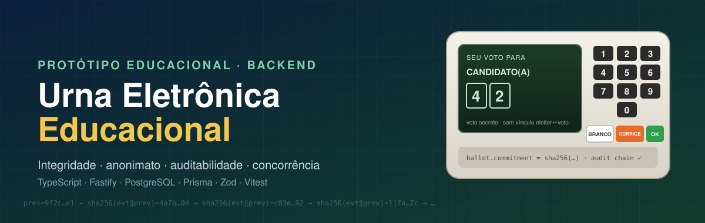
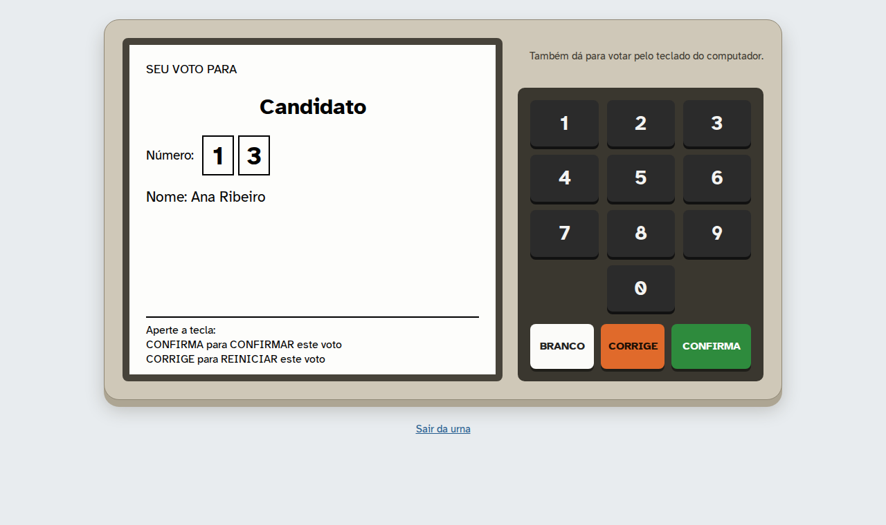
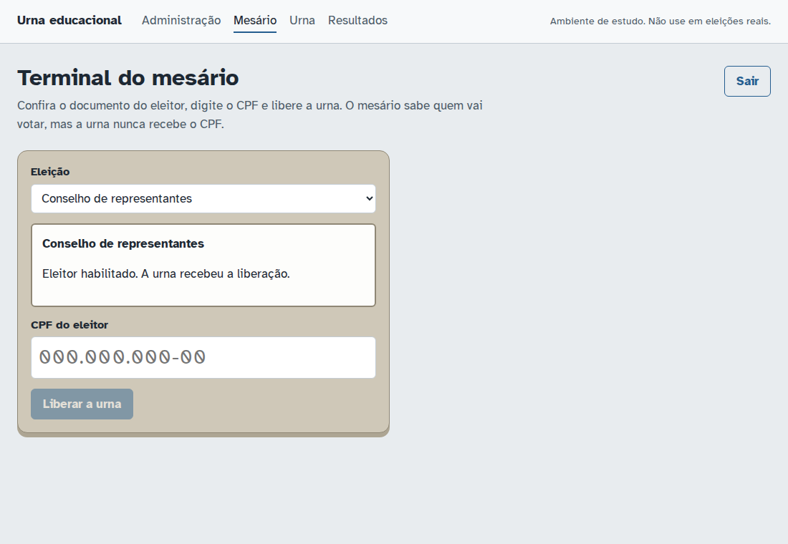
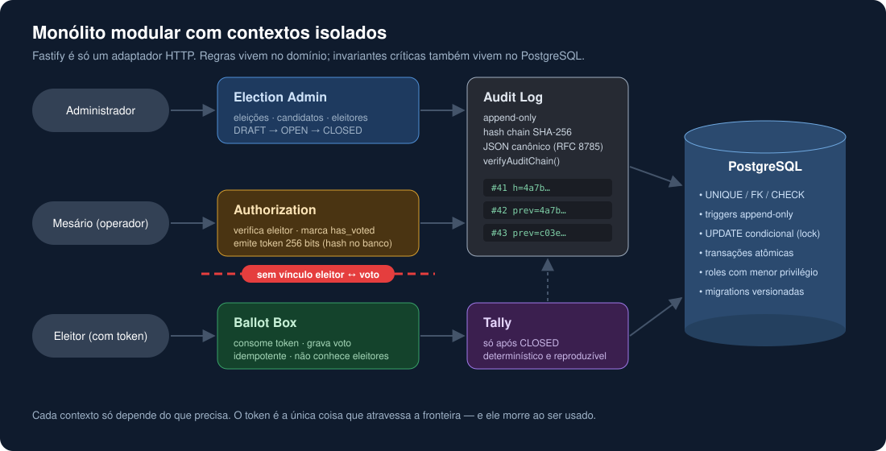
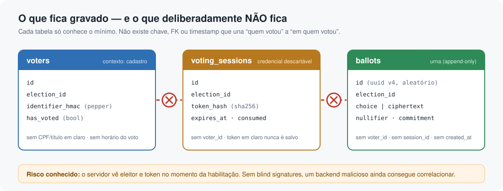
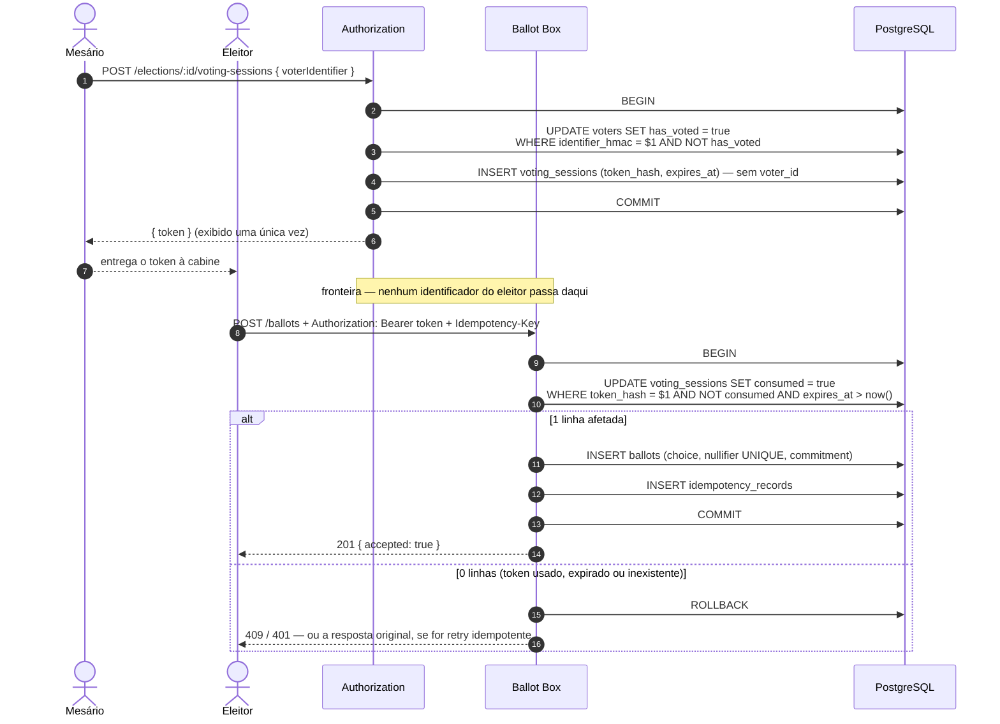
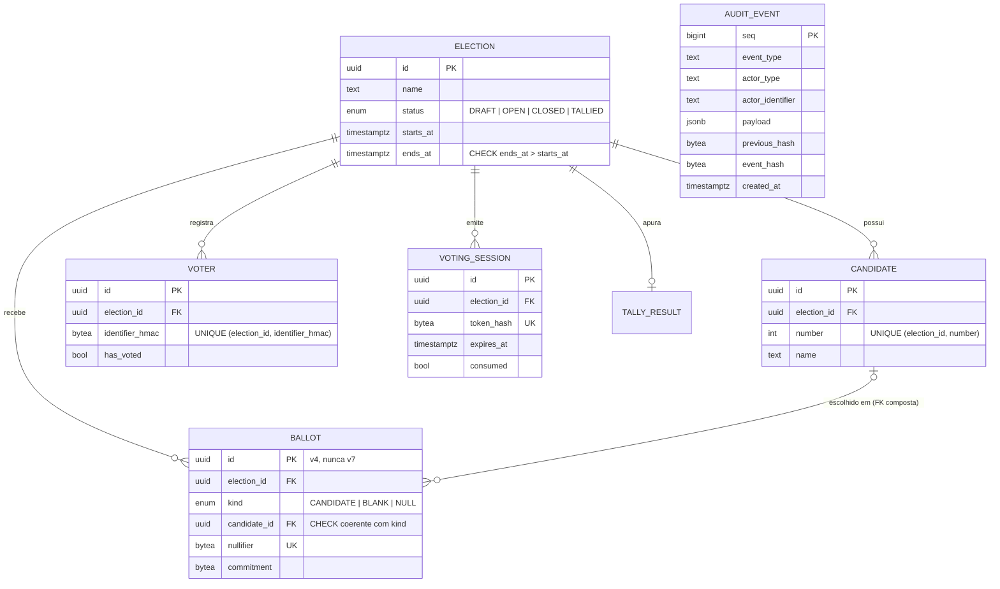

<div align="center">



<br />


**Um backend de urna eletrônica construído do zero para estudar o que torna um sistema de votação difícil:**<br />
integridade, voto secreto, auditabilidade, criptografia e concorrência.

[Por quê](#-por-que-este-projeto) ·
[Princípios](#-princípios) ·
[Arquitetura](#-arquitetura) ·
[Fluxo de voto](#-fluxo-de-voto) ·
[Ameaças](#-modelo-de-ameaças-resumo) ·
[TS × Rust](#-typescript--rust) ·
[Roadmap](#-roadmap)

</div>

---

> [!CAUTION]
> **Este projeto NÃO é adequado para eleições reais** — governamentais, sindicais, condominiais ou de qualquer tipo.
> Ele é um laboratório para estudar arquitetura e segurança de aplicações. Um sistema eleitoral real exige
> hardware dedicado, cadeia de custódia, código auditado publicamente, procedimentos físicos, legislação
> e muito mais do que um backend HTTP pode oferecer.

> [!TIP]
> **Comece pelo [guia completo](docs/guia-completo.md)**: ele explica o projeto inteiro, fase a fase,
> com os conceitos, as decisões, os erros encontrados no caminho e o que o sistema não garante.
> Para ver tudo funcionando em segundos: `npm run demo`.

## 🖥️ Experimente pelo navegador

<p align="center">
  
</p>

<table>
  <tr>
    <td width="50%"></td>
    <td width="50%"></td>
  </tr>
  <tr>
    <td><b>Terminal do mesário</b>: confere o CPF e libera a urna, que está em outra aba.</td>
    <td><b>Boletim de urna</b>: resultado assinado, verificado de forma independente pelo próprio navegador.</td>
  </tr>
</table>

```bash
npm run dev        # API em :3000
npm run web        # front em http://127.0.0.1:5173
```

Abra **Administração**, **Mesário** e **Urna** em abas diferentes. O mesário libera a urna pela outra aba,
como o cabo que liga o terminal à urna numa seção eleitoral.

## 🗳️ Por que este projeto

Votar parece simples: _uma pessoa, um voto, contar no final._ Mas basta tentar implementar para que as
propriedades comecem a brigar entre si:

- **Voto secreto × "um eleitor, um voto".** Para impedir voto duplo, o sistema precisa saber _quem_ votou.
  Para manter o sigilo, ele **não pode** saber _em quem_.
- **Auditabilidade × anonimato.** Logs detalhados ajudam a investigar fraudes — e também ajudam a
  reidentificar eleitores por horário.
- **Retries × unicidade.** Clientes repetem requisições por timeout; o servidor precisa ser idempotente
  sem criar dois votos.
- **Concorrência × invariantes.** Duas requisições simultâneas com o mesmo token: exatamente uma vence.

Este repositório explora essas tensões em pequenas fases, com testes que **provam** cada invariante.

## 📐 Princípios

| #   | Propriedade                                    | Onde é garantida                                            |
| --- | ---------------------------------------------- | ----------------------------------------------------------- |
| 1   | Um eleitor vota uma única vez                  | `UPDATE` condicional + `UNIQUE` no banco                    |
| 2   | O voto é secreto                               | Separação de contextos, sem `voter_id` no voto              |
| 3   | Não existe relação persistente eleitor → voto  | Modelo de dados + ausência de timestamps correlacionáveis   |
| 4   | Voto registrado não muda silenciosamente       | Triggers append-only + commitment + Merkle root na apuração |
| 5   | Operações administrativas são auditadas        | Audit log em hash chain                                     |
| 6   | Autenticação separada do armazenamento do voto | Token descartável atravessa a fronteira, nada mais          |
| 7   | Apuração reproduzível                          | Tally determinístico a partir dos votos armazenados         |
| 8   | Operações críticas são transacionais           | Uma transação por voto, consumo atômico do token            |
| 9   | Resistente a retries e concorrência            | `Idempotency-Key` + constraints do PostgreSQL               |
| 10  | Invariantes cobertas por testes                | Vitest contra PostgreSQL real, sem mocks de banco           |

> [!NOTE]
> Nada aqui é rotulado como "seguro". Cada propriedade é classificada como **garantida**,
> **parcialmente mitigada**, **não garantida** ou **risco conhecido** — sempre diferenciando
> _segurança da aplicação_ de _segurança de um sistema eleitoral real_.

## 🧱 Arquitetura

<p align="center">
  
</p>

Um **monólito modular**: um único processo e um único banco, mas com contextos que não se enxergam.
O contexto **Ballot Box** não importa nada de **Authorization** — a única coisa que atravessa a fronteira
é um token aleatório de 256 bits, que morre ao ser usado.

### O que fica gravado — e o que não fica

<p align="center">
  
</p>

Uma decisão central (e contraintuitiva): **o eleitor é marcado como `has_voted` no momento em que
recebe a autorização, não quando o voto é gravado.** Se as duas coisas acontecessem na mesma transação,
o banco precisaria saber qual eleitor está por trás de qual token — e o `txid`, o horário e a ordem de
inserção seriam suficientes para ligar eleitor e voto. É o mesmo princípio da urna brasileira: o mesário
habilita o eleitor, e a urna nunca sabe quem está votando.

## 🔁 Fluxo de voto



### Modelo de dados (proposta inicial)



## 🛡️ Modelo de ameaças (resumo)

| Ameaça                                         | Mitigação principal                                     | Classificação                                               |
| ---------------------------------------------- | ------------------------------------------------------- | ----------------------------------------------------------- |
| Eleitor tenta votar duas vezes                 | `UPDATE … WHERE NOT has_voted` + `UNIQUE`               | ✅ garantida (na aplicação)                                 |
| Duas requisições simultâneas com o mesmo token | Consumo atômico via row lock + `nullifier UNIQUE`       | ✅ garantida                                                |
| Retry por timeout                              | `Idempotency-Key` gravada na mesma transação do voto    | ✅ garantida                                                |
| Admin altera voto via API                      | Não existe endpoint; triggers bloqueiam `UPDATE/DELETE` | ✅ garantida (na aplicação)                                 |
| Alteração direta no banco por superusuário     | Commitments + Merkle root assinada no fechamento        | 🟡 parcialmente mitigada                                    |
| Correlação eleitor ↔ voto pelo banco           | Sem FK, sem timestamps, UUID v4                         | 🟡 parcialmente mitigada (`xmin`/WAL vazam ordem)           |
| Backend malicioso correlaciona em memória      | Blind signatures (RFC 9474) — fase futura               | 🔴 não garantida                                            |
| Vazamento do banco                             | Identificadores com HMAC + pepper fora do banco         | 🟡 parcialmente mitigada                                    |
| Edição/remoção de eventos de auditoria         | Hash chain + `verifyAuditChain()`                       | 🟡 detecta edição no meio; truncamento exige âncora externa |
| Coerção / venda de voto                        | Nenhum recibo nem id de voto na resposta                | ⚠️ risco conhecido                                          |

O modelo completo, com ativo, atacante, vetor, impacto, mitigação e risco residual de cada ameaça,
está em [`docs/threat-model.md`](docs/threat-model.md).

## 🧰 Stack

| Camada    | Escolha                           | Por quê                                                    |
| --------- | --------------------------------- | ---------------------------------------------------------- |
| Runtime   | Node.js LTS + TypeScript `strict` | Tipos como documentação viva do domínio                    |
| HTTP      | Fastify                           | Rápido, schema-first, ótimo `inject()` para testes         |
| Banco     | PostgreSQL                        | Transações, row locking, constraints, triggers             |
| ORM       | Prisma (+ SQL nas migrations)     | Produtividade; o que o Prisma não expressa vai em SQL puro |
| Validação | Zod                               | Body, params, headers **e** variáveis de ambiente          |
| Testes    | Vitest contra PostgreSQL real     | Concorrência não se testa com mock                         |
| Cripto    | `node:crypto`, libs auditadas     | Nada de criptografia caseira                               |

## 🦀 TypeScript × Rust

O backend também existe em **Rust** (`rust/`: axum, tokio, sqlx), com o **mesmo contrato HTTP, o
mesmo banco e as mesmas migrations**. A equivalência é verificada, não suposta: vetores de
criptografia gerados pelo TS que o Rust precisa reproduzir byte a byte, uma suíte de contrato HTTP
que roda os mesmos testes contra os dois servidores, o e2e do navegador e o verificador
independente.

| Mesmo cenário, via HTTP, mesmo total de conexões com o banco |       TypeScript (1 processo) | TypeScript (4 processos) |   Rust (1 processo) |
| ------------------------------------------------------------ | ----------------------------: | -----------------------: | ------------------: |
| Vazão (eleitores/s, habilitação + voto)                      |                          ~500 |                      884 |          **~1.430** |
| CPU usada                                                    |                    1,1 núcleo |              4,2 núcleos |      **1,1 núcleo** |
| CPU por eleitor                                              |                        2,2 ms |                   4,7 ms |          **0,8 ms** |
| Memória de pico                                              |                        347 MB |                 1.341 MB |           **29 MB** |
| Pronto para receber requisições em                           |                        235 ms |                   311 ms |           **22 ms** |
| O que se implanta                                            | ~491 MB (node + node_modules) |                     idem | **binário de 5 MB** |

Com o Rust, o limite passa a ser o PostgreSQL, não a aplicação. Isso **não** muda nenhuma
classificação de segurança do sistema: as invariantes estão no banco, e o voto secreto contra quem
controla o servidor continua não garantido nas duas versões. Metodologia, todos os números,
ressalvas e o que a troca de linguagem garante ou não em [`docs/typescript-vs-rust.md`](docs/typescript-vs-rust.md).

```bash
npm run rust:build && npm run rust:start             # http://127.0.0.1:3010
npm run test:contract                                # mesmos testes HTTP contra os dois
npm run bench:compare -- 200 100 128 40 4            # benchmark comparativo
```

## 🗺️ Roadmap

- [x] **Fase 0** — Análise: arquitetura, threat model, modelo de dados, fluxo
- [x] **Fase 1** — Bootstrap: TypeScript, Fastify, healthcheck, Docker Compose, Prisma, Vitest, lint
- [x] **Fase 2** — Eleições e candidatos
- [x] **Fase 3** — Eleitores (HMAC + pepper, sem identificação em claro)
- [x] **Fase 4** — Autorização de votação (token aleatório, expirável, single-use, hash no banco)
- [x] **Fase 5** — Voto (transações, concorrência, idempotência, anonimato)
- [x] **Fase 6** — Auditoria (hash chain + `verifyAuditChain()`)
- [x] **Fase 7** — Apuração determinística + testes de consistência
- [x] **Fase 8** — Criptografia avançada (HPKE + chave dividida entre trustees)
- [x] **Fase 9** — Hardening
- [x] **Fase 10** — Atacando o próprio sistema
- [x] **Extra** — Front de estudo, escala nacional e backend reescrito em Rust

### Invariantes que os testes vão provar

```text
INV-1  Um eleitor não consegue votar duas vezes
INV-2  Uma autorização gera no máximo um voto
INV-3  Nenhum ballot possui voterId
INV-4  Votos contabilizados == ballots válidos
INV-5  Alterar um AuditEvent quebra verifyAuditChain()
INV-6  Retries não criam votos duplicados
INV-7  N requisições concorrentes com o mesmo token produzem exatamente 1 voto
```

## 🚀 Como rodar

**Pré-requisitos:** Node.js 24+ e Docker (e, para o backend em Rust, o [toolchain do Rust](https://rustup.rs) 1.88+).

```bash
cp .env.example .env      # valores de desenvolvimento
docker compose up -d      # PostgreSQL 18 em 127.0.0.1:5440 (+ banco urna_test)
npm install               # também gera o Prisma Client
npm run db:migrate        # migrations + role de menor privilégio urna_app
npm run demo              # eleição cifrada completa, passo a passo
npm run dev               # http://127.0.0.1:3000
```

```bash
curl localhost:3000/health          # {"status":"ok"}
curl localhost:3000/health/ready    # {"status":"ok","database":"up"}
```

| Comando                                        | O que faz                                                                                     |
| ---------------------------------------------- | --------------------------------------------------------------------------------------------- |
| `npm test`                                     | Vitest contra PostgreSQL real (`urna_test`; recusa qualquer banco que não termine em `_test`) |
| `npm run lint`                                 | ESLint (`strictTypeChecked`) + Prettier                                                       |
| `npm run typecheck`                            | `tsc --noEmit` com `strict` e checagens extras                                                |
| `npm run build` / `npm start`                  | Compila para `dist/` e executa                                                                |
| `npm run db:migrate:dev`                       | Cria uma nova migration a partir do `schema.prisma`                                           |
| `npm run operator:token -- <label>`            | Gera um token de operador e a linha para `ADMIN_CREDENTIALS` / `POLL_WORKER_CREDENTIALS`      |
| `npm run secret:generate`                      | Gera 32 bytes aleatórios em base64url (ex.: `VOTER_ID_PEPPER`)                                |
| `npm run signing-key:generate`                 | Gera a chave Ed25519 de lacre/resultado                                                       |
| `npm run verify:result -- <url> <id>`          | Verifica um resultado publicado, sem acesso ao banco                                          |
| `npm run trustees:keygen -- <partes> <limiar>` | Par HPKE da eleição + partes Shamir da chave privada                                          |
| `npm run bench -- 1000 10000 50000`            | Benchmark de habilitação, voto, lacre e apuração                                              |
| `npm run bench:national -- 200 100 64 4`       | Muitas seções votando ao mesmo tempo, N processos da aplicação                                |
| `npm run test:contract`                        | Mesma suíte HTTP contra o backend TS e o backend Rust                                         |
| `npm run rust:build` / `npm run rust:start`    | Compila (release) e roda o backend em Rust em http://127.0.0.1:3010                           |
| `npm run bench:compare -- 200 100 128 40 4`    | TypeScript × Rust via HTTP: vazão, latência, CPU, memória, tamanho                            |
| `npm run web`                                  | Front de estudo em http://127.0.0.1:5173 (com a API rodando)                                  |
| `npm run web:e2e`                              | Eleição cifrada inteira pela interface (Playwright)                                           |

### Experimentando a API

O `.env.example` traz uma credencial de admin **só para desenvolvimento**. O token está no comentário
acima de `ADMIN_CREDENTIALS` (o de mesário, acima de `POLL_WORKER_CREDENTIALS`). Para gerar uma sua:
`npm run operator:token -- <seu-nome>`.

```bash
TOKEN=<token do .env.example>
curl -s localhost:3000/admin/elections -H "Authorization: Bearer $TOKEN" \
  -H 'content-type: application/json' \
  -d '{"name":"Grêmio","startsAt":"2030-01-01T08:00:00Z","endsAt":"2030-01-01T17:00:00Z"}'
```

| Endpoint                                                 | Acesso                     | Fase |
| -------------------------------------------------------- | -------------------------- | ---- |
| `GET /health`, `GET /health/ready`                       | público                    | 1    |
| `POST /admin/elections`                                  | admin                      | 2    |
| `GET /elections/:id`                                     | público                    | 2    |
| `POST /admin/elections/:id/open` · `/close`              | admin                      | 2    |
| `POST /admin/elections/:id/candidates`                   | admin                      | 2    |
| `GET /elections/:id/candidates`                          | público                    | 2    |
| `POST /admin/elections/:id/voters`                       | admin                      | 3    |
| `POST /elections/:id/voting-sessions`                    | mesário                    | 4    |
| `POST /ballots`                                          | eleitor (token de votação) | 5    |
| `GET /admin/audit`, `GET /admin/audit/verify`            | admin                      | 6    |
| `POST /admin/elections/:id/tally`                        | admin                      | 7    |
| `GET /elections/:id/tally`, `GET /elections/:id/ballots` | público (após a apuração)  | 7    |

Contrato completo em [`docs/voting-flow.md`](docs/voting-flow.md).

> A porta 5440 evita conflito com um PostgreSQL local. Para mudar, defina `POSTGRES_PORT` e ajuste as URLs no `.env`.

## 📚 Documentação

> Os documentos evoluem a cada fase.

| Documento                                                  | Conteúdo                                                              |
| ---------------------------------------------------------- | --------------------------------------------------------------------- |
| [`docs/guia-completo.md`](docs/guia-completo.md)           | **Comece aqui:** o projeto inteiro explicado, fase a fase             |
| [`docs/architecture.md`](docs/architecture.md)             | Componentes, fluxos e diagramas Mermaid                               |
| [`docs/threat-model.md`](docs/threat-model.md)             | Ameaças, atacantes, mitigações e riscos residuais                     |
| [`docs/voting-flow.md`](docs/voting-flow.md)               | Passo a passo do voto, da habilitação à apuração                      |
| [`docs/security.md`](docs/security.md)                     | Criptografia, chaves, logs e redaction                                |
| [`docs/hardening-review.md`](docs/hardening-review.md)     | Revisão de segurança da Fase 9                                        |
| [`docs/attack-report.md`](docs/attack-report.md)           | Fase 10: ataques ao próprio sistema, correções e o que ainda funciona |
| [`docs/performance.md`](docs/performance.md)               | Benchmark, gargalos encontrados e corrigidos (O(n²) → O(1), deadlock) |
| [`docs/typescript-vs-rust.md`](docs/typescript-vs-rust.md) | As duas implementações: equivalência, benchmark e segurança           |

## 🔗 Referências

- TSE — [Registro Digital do Voto (RDV)](https://www.tse.jus.br/eleicoes/urna-eletronica) e embaralhamento de votos na urna brasileira
- Ben Adida — [Helios: Web-based Open-Audit Voting](https://www.usenix.org/legacy/event/sec08/tech/full_papers/adida/adida.pdf)
- Microsoft — [ElectionGuard](https://www.electionguard.vote/)
- [RFC 9474](https://www.rfc-editor.org/rfc/rfc9474) — RSA Blind Signatures
- [RFC 9180](https://www.rfc-editor.org/rfc/rfc9180) — Hybrid Public Key Encryption (HPKE)
- [RFC 8785](https://www.rfc-editor.org/rfc/rfc8785) — JSON Canonicalization Scheme
- PostgreSQL — [Transaction Isolation](https://www.postgresql.org/docs/current/transaction-iso.html)

## 📄 Licença

[MIT](LICENSE) — use para estudar, ensinar e quebrar. Não use para eleger ninguém.
