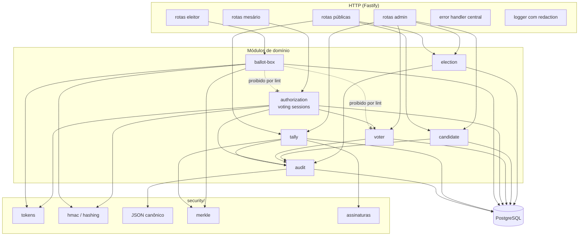
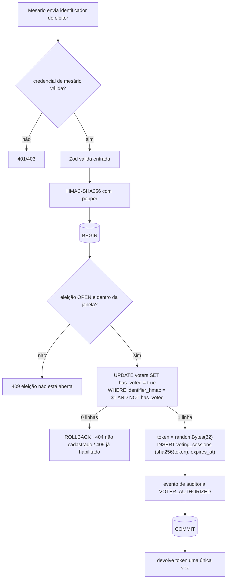
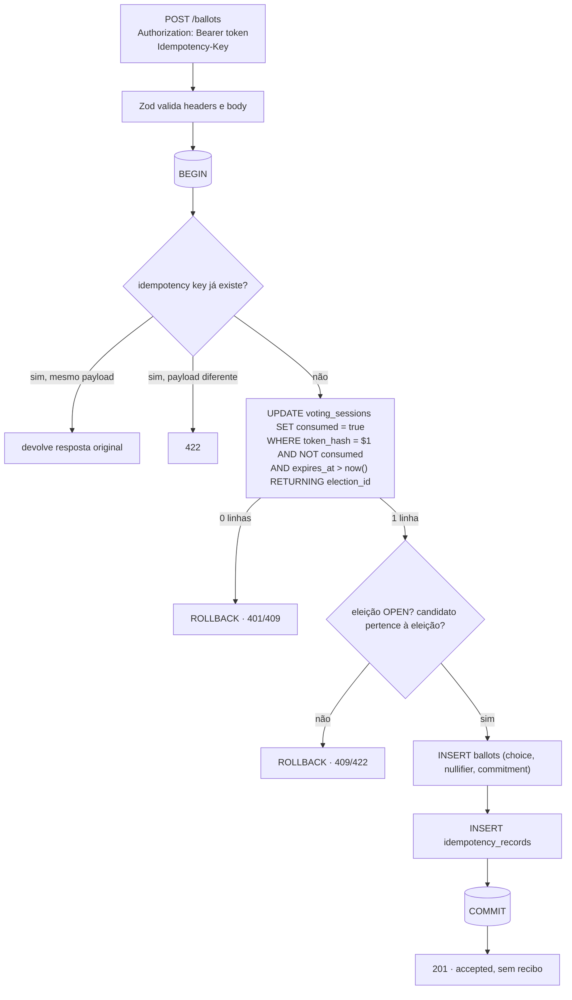
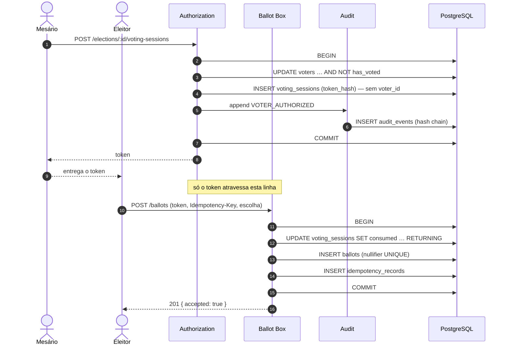
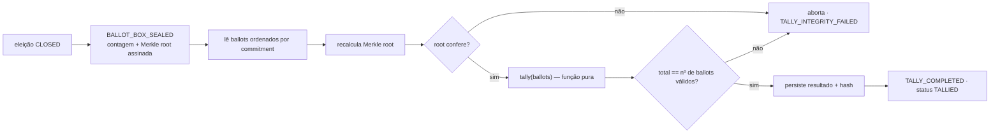

# Arquitetura

## Visão geral

A aplicação é um **monólito modular**: um processo Node.js, um banco PostgreSQL e módulos que não se
enxergam além do necessário. Microsserviços trariam rede, consistência eventual e deploy distribuído
sem nenhum ganho para os objetivos de estudo.

Princípios:

- **Fastify é um adaptador.** Rotas validam entrada (Zod), chamam um caso de uso e serializam a saída.
  Regras de negócio não importam Fastify.
- **O banco é a última linha de defesa.** Toda invariante que pode ser expressa em SQL (FK, `UNIQUE`,
  `CHECK`, trigger, privilégio) também é expressa lá, não só em TypeScript.
- **Dependências explícitas.** `buildApp({ env, prisma })` recebe tudo por parâmetro. Não há singletons
  escondidos, e os testes montam a aplicação com um banco real.
- **Abstrações só quando pagam.** Repository pattern só aparece se houver mais de uma implementação
  ou se ele isolar SQL difícil de ler.

## Componentes



| Módulo          | Responsabilidade                                        | Conhece o eleitor?              |
| --------------- | ------------------------------------------------------- | ------------------------------- |
| `election`      | ciclo de vida `DRAFT → OPEN → CLOSED → TALLIED`         | —                               |
| `candidate`     | candidatos de uma eleição (só em `DRAFT`)               | —                               |
| `voter`         | cadastro de eleitores (identificador com HMAC + pepper) | sim                             |
| `authorization` | habilitação: marca `has_voted` e emite token            | sim, **só neste momento**       |
| `ballot-box`    | consome o token e grava o voto                          | **não**                         |
| `tally`         | apuração determinística após `CLOSED`                   | não                             |
| `audit`         | hash chain de eventos administrativos                   | não (eventos sem dados de voto) |

### Camadas dentro de um módulo

```
modules/<nome>/
  domain/        # tipos, regras puras, erros de domínio — sem Fastify, sem Prisma
  application/   # casos de uso; abrem transações e orquestram
  http/          # rotas Fastify + schemas Zod
```

## Fluxo de autenticação e habilitação



## Fluxo de voto



## Sequência completa



### Por que não "uma transação que faz tudo"?

O fluxo intuitivo consome o token, grava o voto e marca o eleitor numa transação só. Para isso, a
sessão precisaria guardar o `voter_id`, e o banco teria, no mesmo `txid`, com o mesmo horário e em
sequência, as linhas do eleitor e do voto. Separar em duas transações, em momentos diferentes,
remove esse vínculo. Custo: um token abandonado consome o direito de voto (ver T19 no
[modelo de ameaças](threat-model.md)).

## Apuração



A função de apuração é pura: mesma entrada, mesma saída, em qualquer máquina. Qualquer pessoa com
acesso aos ballots consegue reproduzir o resultado.

## Estrutura de diretórios

```
src/
  app.ts                  # buildApp(deps): monta Fastify, sem abrir porta
  server.ts               # composition root: env, prisma, listen, shutdown
  config/env.ts           # Zod sobre process.env
  database/client.ts      # PrismaClient com @prisma/adapter-pg
  modules/<módulo>/       # domain/ application/ http/
  security/               # tokens, hmac, JSON canônico, merkle, assinaturas
  shared/
    errors/               # AppError + error handler central
    logging/              # opções do logger, whitelist e redaction
  generated/prisma/       # cliente gerado (não versionado)
prisma/
  schema.prisma
  migrations/             # SQL versionado, incluindo CHECKs, triggers e roles
test/
  unit/  integration/  invariants/  adversarial/  helpers/
```

## Decisões registradas

| Decisão                                               | Alternativa descartada                          | Motivo                                                             |
| ----------------------------------------------------- | ----------------------------------------------- | ------------------------------------------------------------------ |
| Monólito modular                                      | Microsserviços                                  | Complexidade sem ganho didático                                    |
| `has_voted` na habilitação                            | Na gravação do voto                             | Remove o vínculo eleitor ↔ voto no banco                           |
| `READ COMMITTED` + `UPDATE` condicional               | `SERIALIZABLE` em tudo                          | Mesma garantia para este caso, sem retries                         |
| Merkle root de commitments ordenados                  | Hash chain de ballots                           | Uma cadeia registra a ordem de chegada e ajuda a correlacionar     |
| Evento agregado `BALLOT_BOX_SEALED`                   | `VOTE_ACCEPTED` por voto                        | Evita correlação por tempo no audit log                            |
| Testes contra PostgreSQL real                         | Mocks do banco                                  | Concorrência e constraints não se testam com mock                  |
| Transição de estado por `UPDATE` condicional          | Ler, checar em TS, gravar                       | Sem janela TOCTOU; o banco serializa chamadas concorrentes         |
| Regras de estado também em triggers                   | Só no TypeScript                                | Valem para qualquer acesso SQL, não só para a API                  |
| Trigger de candidatos com `FOR SHARE`                 | Só checagem na aplicação                        | Serializa inserção de candidato com abertura concorrente           |
| HMAC com chave derivada por eleição                   | Um pepper global                                | Impede cruzar a participação de alguém entre eleições              |
| `has_voted` só `false → true`, só em `OPEN` (trigger) | Só na aplicação                                 | Prepara a habilitação da Fase 4 com garantia no banco              |
| Habilitação numa única instrução SQL                  | Várias queries numa transação montada no código | Atomicidade e lock no mesmo comando                                |
| Constraint trigger de balanço (adiada)                | Confiar no código                               | Sessão sem eleitor marcado (ou o inverso) falha no COMMIT          |
| Relógio da aplicação passado ao SQL                   | `now()` do banco                                | Uma fonte de tempo; testes determinísticos (risco: skew)           |
| `ADMIN` ≠ `POLL_WORKER`                               | Um papel só                                     | Separação de funções                                               |
| Sem recibo de voto                                    | Recibo com commitment                           | Recibo + lista publicada = prova do voto (venda/coerção)           |
| Nullifier sem chave secreta                           | HMAC com chave                                  | Token de 256 bits já impede a ligação; um segredo a menos          |
| Idempotência com HMAC(token, …)                       | SHA-256(payload)                                | Poucos payloads possíveis: hash simples revelaria o voto           |
| Balanço votos == sessões consumidas                   | Confiar no código                               | Voto sem token (ou token sem voto) falha no COMMIT                 |
| Auditoria na mesma transação da operação              | Log assíncrono / fila                           | Evento existe se e somente se a operação aconteceu                 |
| Uma cadeia global com advisory lock                   | Uma cadeia por eleição                          | Detecta remoção de eleições inteiras; custo: escritas serializadas |
| Encadeamento verificado pelo banco no INSERT          | Só na verificação                               | Nem a role da aplicação bifurca a cadeia                           |
| `VOTER_AUTHORIZED` sem eleitor; sem evento por voto   | Evento completo                                 | Evita correlação eleitor ↔ sessão ↔ voto por horário               |
| `close` só depois de `endsAt`                         | Admin fecha quando quiser                       | Impede encerrar a votação antes da hora                            |
| Relógio injetado (`Clock`)                            | `new Date()` espalhado                          | Testes de tempo sem `sleep`                                        |
| Prisma + SQL nas migrations                           | Só Prisma                                       | O Prisma não expressa CHECK, triggers nem roles                    |
