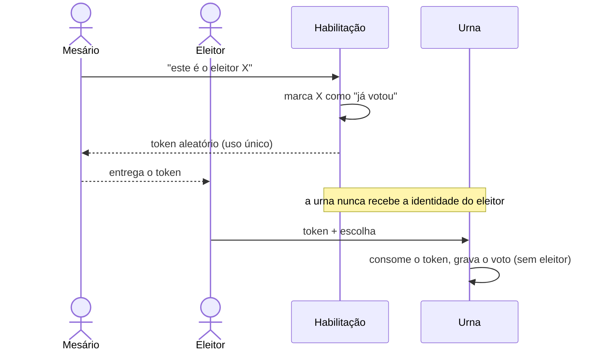

# Guia completo da urna eletrônica educacional

Este guia explica **o projeto inteiro**, da Fase 0 à 10: o que foi construído, por que cada decisão
foi tomada, quais conceitos de segurança aparecem, o que deu errado no caminho e o que o sistema
**não** consegue garantir. Ele foi escrito para ser lido com calma, de preferência com o código e o
`npm run demo` abertos ao lado.

Os outros documentos são referências mais curtas:
[architecture.md](architecture.md) · [threat-model.md](threat-model.md) ·
[voting-flow.md](voting-flow.md) (contrato da API) · [security.md](security.md) ·
[hardening-review.md](hardening-review.md) · [attack-report.md](attack-report.md).

## Sumário

1. [O que é, e o que não é](#1-o-que-é-e-o-que-não-é)
2. [Rodando e experimentando](#2-rodando-e-experimentando)
3. [O problema central em uma página](#3-o-problema-central-em-uma-página)
4. [Conceitos usados no projeto](#4-conceitos-usados-no-projeto)
5. [Fase a fase](#5-fase-a-fase)
6. [O ciclo de vida de uma eleição, tabela por tabela](#6-o-ciclo-de-vida-de-uma-eleição-tabela-por-tabela)
7. [As invariantes e quem as garante](#7-as-invariantes-e-quem-as-garante)
8. [O que o sistema garante e o que não garante](#8-o-que-o-sistema-garante-e-o-que-não-garante)
9. [Erros encontrados no caminho](#9-erros-encontrados-no-caminho)
10. [Como ler o código](#10-como-ler-o-código)
11. [Próximos passos possíveis](#11-próximos-passos-possíveis)

---

## 1. O que é, e o que não é

É o **backend** de uma urna eletrônica, escrito em TypeScript (Fastify, PostgreSQL, Prisma, Zod,
Vitest), construído para estudar como várias propriedades de um sistema de votação conversam e
brigam entre si:

- um eleitor vota uma vez **e** o voto é secreto;
- tudo é auditável **e** a auditoria não pode identificar o eleitor;
- o resultado é reproduzível **e** ninguém prova em quem votou;
- requisições repetidas e simultâneas não criam votos extras.

**Não é** um sistema adequado para nenhuma eleição real. Ao longo do guia aparecem dois níveis de
segurança que não devem ser confundidos:

- **Segurança da aplicação:** o que este código, este banco e estes testes garantem.
- **Segurança de um sistema eleitoral real:** inclui hardware dedicado, urna offline, cadeia de
  custódia, procedimentos de mesa, fiscalização, código auditado publicamente, legislação. Quase
  nada disso cabe num backend HTTP.

As propriedades são sempre classificadas com quatro rótulos:
✅ **garantida** (com teste) · 🟡 **parcialmente mitigada** · 🔴 **não garantida** · ⚠️ **risco conhecido**.

---

## 2. Rodando e experimentando

```bash
cp .env.example .env            # valores de DESENVOLVIMENTO
docker compose up -d            # PostgreSQL 18 em 127.0.0.1:5440 (+ banco urna_test)
npm install                     # também gera o Prisma Client
npm run db:migrate              # migrations (como dono) + habilita a role urna_app
npm run demo                    # uma eleição cifrada completa, passo a passo, em segundos
```

O `npm run demo` é o melhor ponto de partida. Ele roda a aplicação dentro do próprio processo, com
um relógio simulado, e mostra cada etapa:

1. cerimônia de chaves;
2. criação da eleição;
3. cadastro;
4. abertura;
5. habilitação e voto, incluindo retry, token reusado e eleitor habilitado duas vezes;
6. fechamento com lacre;
7. apuração com 1 parte (recusada) e com 2 partes (aceita);
8. verificação da auditoria e verificação independente do resultado.

Outros comandos úteis:

| Comando                               | Para quê                                                   |
| ------------------------------------- | ---------------------------------------------------------- |
| `npm run dev`                         | Sobe a API em `http://127.0.0.1:3000`                      |
| `npm test`                            | ~510 testes contra PostgreSQL real (~33 s)                 |
| `npm run lint` / `npm run typecheck`  | ESLint estrito + Prettier / `tsc --noEmit`                 |
| `npm run verify:result -- <url> <id>` | Refaz a apuração de uma eleição só com dados públicos      |
| `npm run trustees:keygen -- 5 3`      | Par de chaves de uma eleição cifrada + 5 partes (limiar 3) |
| `npm run operator:token -- <nome>`    | Token de admin ou mesário + linha para o `.env`            |
| `npm run signing-key:generate`        | Chave Ed25519 que assina lacres e resultados               |
| `npm run secret:generate`             | 32 bytes aleatórios (ex.: pepper)                          |

---

## 3. O problema central em uma página

Uma votação precisa responder duas perguntas que se contradizem:

- **"Esta pessoa já votou?"** Para impedir voto duplo, o sistema precisa saber _quem_ votou.
- **"Em quem esta pessoa votou?"** Para o voto ser secreto, o sistema **não pode** saber.

A solução clássica, da urna brasileira, é **separar no tempo e no espaço**:



Três tabelas guardam três coisas diferentes, **sem nada que as ligue**:

| Tabela            | Sabe                                                        | Não sabe                     |
| ----------------- | ----------------------------------------------------------- | ---------------------------- |
| `voters`          | quem está cadastrado e quem já foi habilitado (`has_voted`) | quando, e em quem votou      |
| `voting_sessions` | que existe um token válido (só o hash dele)                 | de quem é                    |
| `ballots`         | as escolhas                                                 | de quem são, quando chegaram |

A decisão mais contraintuitiva do projeto (Fase 0): **o eleitor é marcado como "votou" quando
recebe o token, não quando o voto é gravado.** Se as duas coisas acontecessem na mesma transação, o
banco precisaria saber qual eleitor está por trás de qual voto, e o id da transação, o horário e a
ordem de inserção bastariam para ligá-los. O custo: se o eleitor recebe o token e desiste, ele
"perdeu" o voto (aparece no resultado como _habilitado sem voto_), como na urna real depois que o
mesário libera.

O resto do projeto é, em grande parte, descobrir **por onde mais** eleitor e voto podem ser ligados
(horários, logs, colunas internas do PostgreSQL) e **como** alguém poderia criar, alterar ou apagar
votos, e então fechar ou documentar cada caminho.

---

## 4. Conceitos usados no projeto

Cada conceito aparece com o problema que resolve e onde está no código.

### Hash (SHA-256)

Função que transforma qualquer dado em 32 bytes. É impossível voltar do hash ao dado, e qualquer
mudança no dado muda o hash por completo. **Problema que resolve:** guardar algo sem guardar o
original, ou detectar alteração.
**Armadilha:** se o dado tem poucos valores possíveis, basta testar todos. Um CPF tem ~10⁹ valores,
então `SHA-256(cpf)` é revertido em segundos. Por isso CPF nunca é guardado com hash simples.
→ `src/security/tokens.ts` (hash do token de votação, que tem 2²⁵⁶ valores possíveis: aí o hash simples é seguro).

### HMAC, salt e pepper

**HMAC** é um hash _com chave_: sem a chave, ninguém calcula nem testa valores.

- **Salt:** valor público e diferente por registro, contra tabelas pré-computadas. Não serve aqui:
  precisamos _encontrar_ o eleitor pelo CPF, e um salt aleatório por linha impediria a busca.
- **Pepper:** segredo único, guardado **fora** do banco. É a chave do HMAC.

O identificador do eleitor é `HMAC(chave_da_eleição, cpf)`. Quem vaza só o banco não reverte nada;
quem vaza banco **e** pepper reverte em segundos (⚠️ risco conhecido; um hash lento como scrypt subiria
isso para ~1 CPU-ano).
→ `src/security/voter-identifier.ts`, Fase 3.

### HKDF (derivação de chaves)

Gera várias chaves independentes a partir de um segredo. Cada eleição usa
`HKDF(pepper, salt = id da eleição)` como chave do HMAC: o mesmo CPF gera valores diferentes em
eleições diferentes, e um vazamento não permite cruzar a participação de uma pessoa entre eleições.

### Aleatoriedade criptográfica (CSPRNG)

Tokens precisam ser imprevisíveis: `crypto.randomBytes(32)` dá 256 bits de entropia. `Math.random()`
é previsível e **proibido pelo lint** do projeto.

### Transação, `READ COMMITTED` e o `UPDATE` condicional

Uma transação é "tudo ou nada". O nível de isolamento padrão do PostgreSQL (`READ COMMITTED`) faz
cada comando ver o que já foi confirmado no momento em que começa.

O padrão mais importante do projeto é **não separar "verificar" de "alterar"**:

```sql
-- errado (TOCTOU): SELECT para ver se o token está livre... e depois UPDATE
-- certo: verificar e alterar no MESMO comando
UPDATE voting_sessions SET consumed = true
 WHERE token_hash = $1 AND NOT consumed AND expires_at > $agora
RETURNING election_id;
```

Com duas requisições simultâneas, a segunda espera o **lock da linha** que a primeira pegou. Quando
a primeira confirma, a segunda **reavalia o `WHERE`**, vê `consumed = true` e não altera nada. Sem
lock em memória, sem `SERIALIZABLE`, sem retries. O mesmo padrão aparece em abrir, fechar e apurar
eleições, e na habilitação.

### Constraints, triggers e constraint triggers adiadas

O banco é a **última linha de defesa**: o que pode ser garantido em SQL também é garantido lá, não só
no TypeScript.

- `CHECK`: valores válidos (`ends_at > starts_at`, hash com 32 bytes, voto em candidato ⇔ `candidate_id` preenchido).
- `UNIQUE`: número de candidato, eleitor por eleição, token, `nullifier`.
- **FK composta** `(election_id, candidate_id)`: o candidato votado pertence à mesma eleição.
- **Triggers**: máquina de estados, campos congelados, votos e auditoria só de acréscimo
  (append-only). Cada um tem um código de erro próprio (`UE001`…`UE013`).
- **Constraint trigger adiada** (`DEFERRABLE INITIALLY DEFERRED`): verificada no **COMMIT**, para
  regras que envolvem várias linhas da transação. Exemplos: "sessões == eleitores habilitados" e
  "votos == sessões consumidas".

### Idempotência

Se a rede cai depois que o servidor gravou o voto, o cliente não sabe o que aconteceu e repete a
requisição. Com o header `Idempotency-Key`, o servidor guarda a resposta e devolve **a mesma
resposta** no retry, em vez de recusar ou, pior, duplicar.
O detalhe de segurança: o registro guarda `HMAC(token, chave)` e `HMAC(token, payload)`, nunca
`SHA-256(payload)`. Com poucos payloads possíveis (um por candidato), um hash simples revelaria o
voto. → `src/security/ballot-crypto.ts`, Fase 5.

### MVCC e `xmin` (por que o banco "lembra" mais do que parece)

O PostgreSQL guarda em cada linha colunas invisíveis. `xmin` é o id da transação que criou aquela
versão da linha. Duas linhas escritas na **mesma transação** têm o **mesmo `xmin`**. Isso cria
vínculos que nenhuma FK mostra: eleitor ↔ sessão (habilitação) e sessão ↔ voto (consumo + voto).
Esse é o maior risco conhecido do projeto (🔴), provado por teste em
`test/adversarial/known-risks.test.ts`. Um `pg_dump` lógico não exporta `xmin`; um backup físico
exporta.

### Hash chain (auditoria)

Cada evento guarda o hash do anterior: `hash = SHA-256(dados ‖ hash_anterior)`. Alterar um evento
muda o hash dele e quebra o vínculo com o próximo; remover um evento cria um buraco na sequência.
**Limitação:** apagar os _últimos_ eventos, ou reescrever a cadeia inteira de forma consistente, não
aparece só olhando a cadeia. É preciso uma **âncora**: um hash publicado fora do banco, ou assinado.

### JSON canônico (RFC 8785)

Para assinar ou fazer hash de JSON, a mesma informação precisa virar **sempre os mesmos bytes**
(ordem das chaves, formato dos números). O PostgreSQL devolve o `jsonb` com as chaves em outra
ordem, e o JSON canônico resolve isso. → biblioteca `canonicalize`.

### Merkle tree (RFC 6962)

Uma árvore de hashes resumida num único valor, a **raiz**. Mudar, acrescentar ou remover qualquer
folha muda a raiz. As folhas são os _commitments_ dos votos, em ordem de bytes, não de chegada. A
implementação segue a RFC 6962 (Certificate Transparency) e foi conferida com os vetores de teste
oficiais. → `src/security/merkle.ts`.

### Commitment

Um hash do conteúdo do voto (`id ‖ eleição ‖ tipo ‖ candidato`, ou, na v2, do texto cifrado). Serve
como folha da Merkle tree e permite detectar uma linha editada: recalcular o commitment a partir da
linha e comparar.

### Assinatura digital (Ed25519)

Quem tem a **chave privada** assina; qualquer um com a **chave pública** confere. O banco não tem a
chave, então quem controla só o banco não consegue forjar um lacre, um resultado ou um evento de
habilitação. → `src/security/signing.ts`.

### HPKE, AEAD e AAD (voto cifrado, v2)

**HPKE** (RFC 9180) cifra uma mensagem para a chave pública de alguém. Aqui: X25519 para combinar
chaves, HKDF para derivar, AES-256-GCM para cifrar.

- **AEAD:** o AES-GCM detecta qualquer bit alterado no texto cifrado.
- **AAD:** dados _amarrados_ ao texto cifrado sem serem cifrados. Aqui são a eleição e o id do voto.
  Copiar o texto cifrado para outro voto ou outra eleição faz a decifragem falhar.
- O texto claro tem **tamanho fixo** (17 bytes), então o tamanho do texto cifrado não revela a escolha.

→ `src/security/ballot-encryption.ts`, biblioteca `@hpke/core`.

### Shamir's Secret Sharing

Divide um segredo em _n_ partes, das quais quaisquer _k_ reconstroem o segredo; com menos de _k_
não se aprende nada. Aqui, a chave privada da eleição é dividida entre "trustees": nem o servidor
nem uma pessoa sozinha decifra votos durante a eleição.
**Armadilha descoberta no projeto:** com menos de _k_ partes (mas pelo menos 2), a biblioteca
**não falha**: devolve um valor errado. Por isso a chave reconstruída é sempre conferida
(`keyPairMatches`) antes de abrir qualquer voto. → `src/security/trustees.ts`.

### Menor privilégio

A aplicação conecta ao banco com a role `urna_app`, que só pode o que o código faz: `INSERT`/`SELECT`,
`UPDATE` apenas em colunas específicas, nada de `UPDATE`/`DELETE` em votos e auditoria, nada de
desligar triggers. As migrations usam outra role, a dona do schema.

---

## 5. Fase a fase

Cada fase terminou com typecheck, lint e testes passando, revisão do diff, docs atualizadas e
commits separados por assunto. O histórico do git conta a mesma história.

### Fase 0: análise

Só documento, nenhum código. As decisões que moldaram tudo:

- **Monólito modular:** um processo, um banco, módulos que não se enxergam. Microsserviços trariam
  rede e consistência eventual sem ganho didático.
- **`has_voted` na habilitação, não no voto** (seção 3).
- Votos sem `created_at` e com ids UUID **v4** (o v7 embute horário).
- Sem evento de auditoria por voto: um `VOTE_ACCEPTED` com horário permitiria correlação.
- Merkle root em vez de hash chain para os votos: uma cadeia registra a ordem de chegada.

### Fase 1: bootstrap

Fastify, Docker Compose (Postgres 18), Prisma 7, Vitest contra banco **real**, ESLint estrito,
validação da env com Zod (a mensagem de erro nunca repete o valor, que pode ser um segredo).
O que já nasceu pensando em segurança:

- logs de requisição em _whitelist_: só método e caminho, **sem headers, sem query string, sem IP**.
  IP + horário em habilitação e voto permitiria correlação;
- redaction de campos sensíveis como segunda barreira;
- erro 500 genérico;
- a suíte de testes recusa rodar contra banco cujo nome não termina em `_test`.

### Fase 2: eleições e candidatos

- Máquina de estados `DRAFT → OPEN → CLOSED → TALLIED`, com transições por `UPDATE` condicional
  (20 chamadas simultâneas de `open` resultam em exatamente 1 sucesso) **e** um trigger que só
  aceita essas transições.
- Nome e janela de votação congelados depois de `DRAFT`. `close` só depois de `endsAt`: um admin não
  encerra a votação antes da hora.
- Candidatos só mudam em `DRAFT`. O trigger usa `SELECT … FOR SHARE` na eleição para serializar com
  uma abertura concorrente.
- Admin autenticado por token cuja configuração guarda só o hash, comparado em tempo constante.
- Bodies com `strictObject`: mandar `"status": "OPEN"` na criação dá 400 (contra _mass assignment_).

### Fase 3: eleitores

CPF validado (dígitos verificadores), normalizado e guardado como `HMAC(HKDF(pepper, eleição), cpf)`.
O CPF nunca é armazenado, devolvido, logado ou citado em mensagem de erro, e há um teste para cada
caso. Trigger: `has_voted` só vai de `false` para `true`, e só com a eleição aberta.

### Fase 4: autorização (habilitação)

- Papéis separados: **admin não habilita eleitor; mesário não acessa `/admin`**.
- A habilitação é **uma única instrução SQL**:
  `WITH voter AS (UPDATE voters … AND NOT has_voted RETURNING …) INSERT INTO voting_sessions …`.
  Sem eleitor atualizado, nenhuma sessão é criada.
- A sessão guarda `SHA-256(token)`, nunca o token, e **não tem `voter_id`**.
- Constraint trigger: no COMMIT, `sessões == eleitores habilitados`. Impede criar sessão sem marcar
  eleitor, que é o caminho para encher a urna.
- Relógio da aplicação como fonte única de tempo, passado ao SQL. Torna os testes determinísticos.

### Fase 5: o voto

Uma transação:

1. procura a `Idempotency-Key`;
2. consome o token (`UPDATE` condicional);
3. confere a eleição e o candidato;
4. grava o voto;
5. grava a resposta para retries.

Erros de validação fazem rollback e **devolvem o token** ao eleitor.

- `nullifier = SHA-256("urna-edu/nullifier/v1" ‖ token)` com `UNIQUE`: um token, no máximo um voto,
  garantido pelo banco.
- Constraint trigger: `votos == sessões consumidas`.
- **Sem recibo.** Um recibo que identifica o voto, cruzado com a lista publicada na apuração,
  permitiria _provar_ em quem se votou (venda de voto). Mudança consciente em relação à Fase 0.
- Testes de mutação: removendo a checagem `AND NOT consumed` do código, o **banco** continuou
  impedindo o segundo voto.

### Fase 6: auditoria

Hash chain com JSON canônico. O evento é gravado **na mesma transação** da operação: existe se e
somente se ela aconteceu. Escritas serializadas por `pg_advisory_xact_lock`, sempre o último lock da
transação (evita deadlock). O banco verifica o encadeamento no `INSERT` e proíbe `UPDATE`, `DELETE`
e `TRUNCATE`.
`verifyAuditChain()` foi testada contra um **superusuário** que desliga os triggers: detecta edição,
remoção e troca de ordem. A limitação também está provada por teste: o truncamento da cauda só
aparece com uma âncora.

### Fase 7: apuração

- **Lacre** no fechamento: Merkle root dos votos + checkpoint da auditoria, **assinados** com Ed25519.
- **Apuração** só depois de conferir assinatura do lacre, cadeia de auditoria, cada commitment,
  Merkle root, contagens e (Fase 10) as assinaturas das habilitações. Se algo falhar: `TALLY_FAILED`,
  `409`, a eleição continua `CLOSED`.
- Contagem como **função pura**: mesma entrada, mesmo resultado, em qualquer ordem e em qualquer
  máquina.
- Nada é publicado antes da apuração (não existe resultado parcial). Depois, o resultado assinado e
  a lista de votos anônimos, em ordem de commitment, ficam públicos.
- `npm run verify:result` refaz tudo usando **só** os endpoints públicos.

### Fase 8: voto cifrado (v2)

Uma eleição criada com `encryptionPublicKey` guarda cada voto **cifrado** (HPKE): `kind` e
`candidate_id` ficam nulos no banco. A chave privada é dividida entre trustees (Shamir) e só é
reconstruída na apuração, conferida antes de abrir qualquer voto. Depois, é publicada para que
qualquer um refaça a decifragem.
**Honestamente:** o servidor ainda vê a escolha no instante em que cifra. A v2 protege o dado
_guardado_ (dump, DBA, backup), não um servidor comprometido. Cifrar no cliente exigiria provas de
que o texto cifrado contém um voto válido (como no ElectionGuard), fora do escopo.

### Fase 9: hardening

O achado mais grave: **a aplicação conectava como superusuário**. Quem roubasse as credenciais dela
poderia desligar triggers. Correção: role `urna_app` de menor privilégio; 14 operações perigosas
agora recebem `42501` do próprio PostgreSQL. Também entraram:

- rate limit;
- headers defensivos;
- timeout de requisição;
- habilitação e voto **sem log de acesso** (correlação por horário);
- a env recusa configuração de desenvolvimento em produção.

Detalhes em [hardening-review.md](hardening-review.md).

### Fase 10: atacando o próprio sistema

Quatro ataques funcionavam e foram corrigidos, cada um com teste que falhava antes da correção:

- **A1, enchimento de urna com as credenciais do banco:** marcar eleitores ausentes, criar e
  consumir sessões, inserir votos válidos. Todos os balanços fechavam e a apuração aceitava. Agora
  cada habilitação gera um evento com nonce **assinado pelo servidor**, e a apuração exige uma
  assinatura válida e única por eleitor habilitado.
- **A2, correlação exata por horário:** `expires_at - TTL` era igual ao horário do evento de
  auditoria, até o milissegundo. Agora a expiração é arredondada para o minuto.
- **A3, lacre duplicado:** a apuração escolhia "um" lacre sem ordem definida. Agora exige exatamente um.
- **A4, resultado forjado:** dava para marcar `TALLIED` e inserir um resultado inventado. Agora o
  servidor confere a assinatura antes de publicar.

Detalhes e a lista de tentativas que **não** funcionaram em [attack-report.md](attack-report.md).

---

## 6. O ciclo de vida de uma eleição, tabela por tabela

O que cada chamada faz no banco, na ordem da demonstração:

| Passo | Chamada                            | `elections`   | `voters`                                 | `voting_sessions`                       | `ballots`                          | `audit_events`                                                |
| ----- | ---------------------------------- | ------------- | ---------------------------------------- | --------------------------------------- | ---------------------------------- | ------------------------------------------------------------- |
| 1     | `POST /admin/elections`            | nova, `DRAFT` |                                          |                                         |                                    | `ELECTION_CREATED`                                            |
| 2     | `POST …/candidates`                |               |                                          |                                         |                                    | `CANDIDATE_CREATED`                                           |
| 3     | `POST …/voters`                    |               | nova linha, `has_voted = false`, só HMAC |                                         |                                    | `VOTER_REGISTERED` (só id interno)                            |
| 4     | `POST …/open`                      | `OPEN`        | congelado                                |                                         |                                    | `ELECTION_OPENED`                                             |
| 5     | `POST …/voting-sessions` (mesário) |               | `has_voted = true`                       | nova, só hash do token, **sem eleitor** |                                    | `VOTER_AUTHORIZED` (nonce assinado, sem eleitor)              |
| 6     | `POST /ballots` (eleitor)          |               |                                          | `consumed = true`                       | novo voto, **sem eleitor/horário** | — (de propósito)                                              |
| 7     | `POST …/close`                     | `CLOSED`      |                                          |                                         | lacrados                           | `ELECTION_CLOSED` + `BALLOT_BOX_SEALED` (assinado)            |
| 8     | `POST …/tally`                     | `TALLIED`     |                                          |                                         |                                    | `TALLY_STARTED` + `TALLY_COMPLETED`; linha em `tally_results` |

Também existe `idempotency_records`: uma linha por voto (passo 6), apagada no fechamento (passo 7).

---

## 7. As invariantes e quem as garante

Cada invariante tem **várias camadas**. Os testes de mutação mostraram, mais de uma vez, que quando
a camada do código falha a do banco segura.

| Invariante                                       | Código                               | Banco                                                                 | Detecção posterior                      | Teste                                                       |
| ------------------------------------------------ | ------------------------------------ | --------------------------------------------------------------------- | --------------------------------------- | ----------------------------------------------------------- |
| **INV-1** um eleitor não vota duas vezes         | `UPDATE … AND NOT has_voted`         | trigger `has_voted` só `false → true`; balanço sessões == habilitados | apuração confere habilitações assinadas | `voting-invariants.test.ts`                                 |
| **INV-2** um token gera no máximo um voto        | `UPDATE … AND NOT consumed`          | `nullifier UNIQUE`; balanço votos == sessões consumidas               | Merkle root no lacre                    | idem                                                        |
| **INV-3** nenhum voto tem `voterId`              | não existe o campo                   | não existe coluna nem FK                                              | —                                       | lê `information_schema` e `pg_constraint`                   |
| **INV-4** contados == votos válidos              | contagem pura                        | —                                                                     | lacre, commitments, contagens           | `test/integration/tally.test.ts`, `test/unit/tally.test.ts` |
| **INV-5** alterar auditoria quebra a verificação | `verifyAuditChain()`                 | encadeamento no `INSERT`; append-only                                 | âncora assinada no lacre                | `audit-invariants.test.ts`                                  |
| **INV-6** retries não duplicam                   | `Idempotency-Key` na mesma transação | PK do registro                                                        | —                                       | 100 retries sequenciais, 30 concorrentes                    |
| **INV-7** concorrência no mesmo token = 1 voto   | `UPDATE` condicional (lock de linha) | `nullifier UNIQUE`                                                    | —                                       | 50 e 300 requisições simultâneas                            |

---

## 8. O que o sistema garante e o que não garante

**Garantido** (✅, com testes): voto único por eleitor e por token, mesmo sob concorrência e retries;
votos e auditoria imutáveis para a aplicação; CPF e token nunca guardados em claro nem logados;
nenhum vínculo eleitor ↔ voto por FK, coluna, horário, log ou endpoint público; apuração que recusa
dados adulterados depois do fechamento; resultado verificável por terceiros.

**Parcialmente mitigado** (🟡): superusuário do banco (detectado depois, não impedido);
vazamento do banco (sem o pepper e sem a chave da eleição, pouca coisa útil); correlação por janela
de um minuto com pouco movimento; auditoria contra truncamento (só com âncora); negação de serviço.

**Não garantido** (🔴):

- **acesso físico ao banco durante a eleição** liga eleitor ↔ sessão ↔ voto pelo `xmin`;
- **servidor comprometido** vê eleitor, token e escolha, e com a chave de assinatura pode encher a
  urna sem deixar rastro;
- a versão 1 guarda a escolha legível (sem vínculo com o eleitor, mas legível).

**Riscos conhecidos e aceitos** (⚠️): token abandonado consome o direito de voto; mesário em conluio
pode habilitar ausentes; coerção na votação remota; segredos em variáveis de ambiente (deveria ser
KMS); sem TLS até o banco no ambiente local; o lock global da auditoria serializa as escritas.

E, de novo: **mesmo se tudo acima fosse ✅, isto não seria uma urna adequada para uma eleição real.**

---

## 9. Erros encontrados no caminho

Nem tudo saiu certo na primeira tentativa. Estes casos ensinam tanto quanto o código final:

1. **Logs com o conteúdo da linha (Fase 2).** Um erro de `CHECK` do PostgreSQL inclui
   `Failing row contains (…)` com a linha inteira. Logar o erro completo, numa tabela de votos,
   colocaria o voto no log. Hoje erros de banco são logados só com códigos.
2. **Autenticação depois do parse do body (Fase 2).** No `preHandler`, um anônimo com JSON
   malformado recebia 400 em vez de 401, e o servidor fazia o parse de corpos de quem nem se
   autenticou. Passou para `onRequest`.
3. **A regra de fronteira do lint não funcionava (Fase 1).** O padrão `**/modules/voter/**` não casa
   com o import relativo `../voter/x.js`. Testar o próprio lint pegou isso.
4. **Falso positivo na checagem de balanço (Fase 4).** Dois `count(*)` em comandos separados, em
   `READ COMMITTED`, viam fotos diferentes do banco. Sob concorrência, a checagem acusava desbalanço
   onde não havia. Corrigido juntando as contagens num comando. A correção foi uma **migration nova**:
   migrations aplicadas nunca são editadas.
5. **Teste intermitente (Fase 1, achado na 4).** O teste de redaction procurava `"42"` no log
   inteiro, e às vezes o PID ou o timestamp continham "42".
6. **`any` silencioso (Fase 8).** Os tipos de uma biblioteca de criptografia usavam `CryptoKey`, que
   em Node existe como valor mas não como tipo. Com `skipLibCheck`, virava `any` sem aviso, e só o
   ESLint percebeu.
7. **Chaves perdidas (Fase 8, teste manual).** Num teste à mão, as partes dos trustees ficaram numa
   variável de terminal que se perdeu, e aquela eleição **nunca mais pode ser apurada**. É exatamente
   o risco operacional real da v2.
8. **Superusuário desde o primeiro dia (achado na Fase 9).** Várias garantias "do banco" das fases
   anteriores só valiam contra quem não tinha as credenciais da aplicação.
9. **Os ataques A1 a A4 (Fase 10).** Todos passavam pelas defesas existentes de forma "legítima",
   usando exatamente as permissões que a aplicação precisa ter.
10. **Edições de texto que falhavam em silêncio (processo).** Duas vezes, uma edição automática não
    encontrou o trecho (reformatado pelo Prettier) e não fez nada, sem erro. Depois disso toda edição
    passou a falhar alto quando o trecho não existe.

---

## 10. Como ler o código

Ordem sugerida (do mais simples ao mais denso):

1. `src/app.ts`: monta tudo; mostra quais módulos existem e como as dependências são passadas.
2. `src/modules/election/`: `domain/` (regras puras) → `application/` (transações) → `http/` (rotas + Zod).
   Todos os módulos seguem essa forma.
3. `prisma/schema.prisma` e `prisma/migrations/*/migration.sql`: os CHECKs, triggers e grants,
   comentados, são metade da segurança do projeto.
4. `src/modules/authorization/application/authorization.service.ts`: a habilitação numa instrução SQL.
5. `src/modules/ballot-box/application/ballot.service.ts`: o voto, a idempotência e a concorrência.
6. `src/modules/audit/domain/audit-chain.ts`: hash chain e verificador (função pura).
7. `src/modules/tally/`: lacre, apuração, verificações de integridade e publicação.
8. `src/security/`: as peças criptográficas, cada uma pequena e comentada.
9. `src/verifier/verify-published.ts`: o que um terceiro faria para conferir um resultado.
10. Os testes, em especial `test/invariants/`, `test/adversarial/` e
    `test/integration/database-constraints.test.ts`. Eles são a especificação executável do sistema.

```
src/
  app.ts · server.ts
  config/env.ts                # Zod sobre process.env (+ regras de produção)
  database/                    # PrismaClient, mapeamento de erros do PostgreSQL
  modules/
    election/ candidate/ voter/   # cadastro (admin)
    authorization/                # habilitação (mesário)
    ballot-box/                   # urna (eleitor) — proibida de importar voter/authorization
    audit/                        # hash chain
    tally/                        # lacre, apuração, publicação
    health/
  security/                    # tokens, HMAC, Merkle, Ed25519, HPKE, Shamir, credenciais
  shared/                      # erros, logs, headers, autenticação de operadores, validação
  verifier/                    # verificação independente de resultados publicados
prisma/                        # schema + 10 migrations (SQL comentado)
scripts/                       # demo, verify:result, geradores de chaves e tokens
test/
  unit/ integration/ invariants/ adversarial/ helpers/
```

---

## 11. Próximos passos possíveis

Se quiser continuar estudando, cada item abaixo ataca um risco documentado:

- **Blind signatures (RFC 9474)**: o token é assinado "às cegas", e nem quem habilita o reconhece
  depois. Ataca o 🔴 do servidor que vê eleitor + token.
- **Separação física** entre o banco de habilitação e o da urna: ataca o 🔴 do `xmin`.
- **Cifragem no cliente com provas de validade** (ElGamal + provas de conhecimento zero, como no
  ElectionGuard e no Helios): ataca o 🔴 do servidor que vê a escolha.
- **Publicação automática das âncoras** (lacres, cabeça da cadeia) num lugar externo: fecha o 🟡 do
  truncamento da auditoria.
- **Hash lento (scrypt/Argon2)** no identificador do eleitor: fecha parte do 🟡 de banco + pepper vazados.
- **KMS/HSM** para pepper, chave de assinatura e partes dos trustees.
- **CI** (GitHub Actions) rodando lint, typecheck e testes com um PostgreSQL de serviço.
