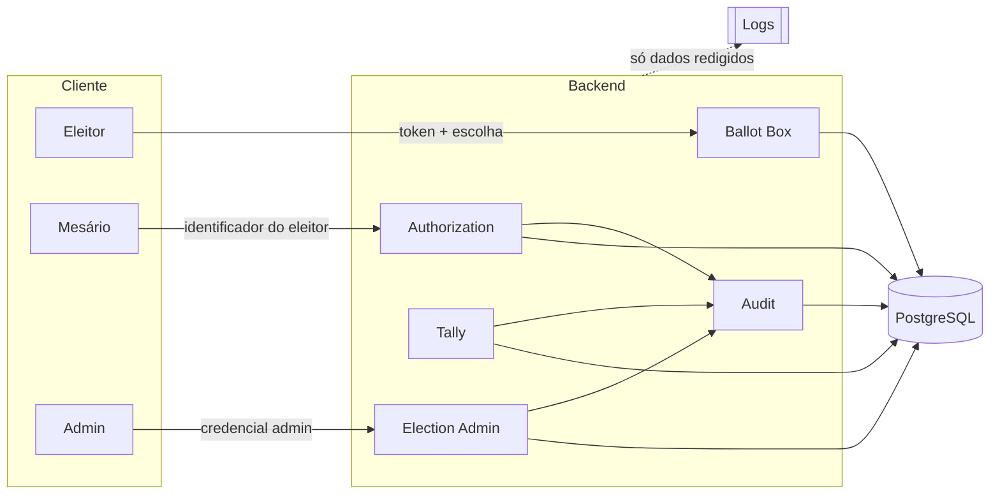

# Modelo de ameaças

> Escopo: **segurança da aplicação** deste protótipo educacional. Um sistema eleitoral real tem
> ameaças que nenhum backend resolve sozinho (cadeia de custódia, hardware, coerção física,
> procedimentos de mesa, legislação). Elas aparecem aqui só quando ajudam a entender um limite.

## Classificação usada

| Rótulo                       | Significado                                                                                     |
| ---------------------------- | ----------------------------------------------------------------------------------------------- |
| ✅ **Propriedade garantida** | Garantida pela aplicação **e** pelo banco, coberta por teste. Vale dentro das premissas abaixo. |
| 🟡 **Parcialmente mitigada** | Reduz probabilidade ou impacto, ou só detecta (não impede).                                     |
| 🔴 **Não garantida**         | O desenho atual não protege.                                                                    |
| ⚠️ **Risco conhecido**       | Aceito conscientemente; documentado em vez de resolvido.                                        |

Nenhuma ameaça é marcada como "resolvida" ou "segura".

## Premissas

1. O processo Node.js e o PostgreSQL **não estão comprometidos** durante a eleição (exceto onde a ameaça diz o contrário).
2. O transporte (TLS) é responsabilidade de um proxy na frente da aplicação.
3. A identificação física do eleitor (documento, biometria) acontece **fora** do sistema, pelo mesário.
4. O relógio do servidor é confiável o suficiente para expiração de tokens (minutos, não milissegundos).

## Ativos

| Ativo                                                                 | Por que importa                                       |
| --------------------------------------------------------------------- | ----------------------------------------------------- |
| **Conteúdo do voto**                                                  | Sigilo do voto.                                       |
| **Vínculo eleitor ↔ voto**                                            | Se existir, o sigilo acaba, mesmo com o voto cifrado. |
| **Registro de quem já votou** (`has_voted`)                           | Garante "um eleitor, um voto".                        |
| **Tokens de votação**                                                 | Quem tem um token válido tem um voto.                 |
| **Integridade da urna** (conjunto de ballots)                         | Base da apuração.                                     |
| **Resultado da apuração**                                             | O que será publicado.                                 |
| **Audit log**                                                         | Prova do que os administradores fizeram.              |
| **Segredos**: pepper, chaves HMAC/assinatura/cifra, credenciais admin | Comprometê-los derruba várias outras proteções.       |

## Atacantes

| Atacante                      | Capacidades assumidas                                              |
| ----------------------------- | ------------------------------------------------------------------ |
| **Eleitor malicioso**         | Cliente HTTP arbitrário, scripts, requisições paralelas, replay.   |
| **Atacante externo**          | Igual ao anterior, sem token válido; pode tentar adivinhar tokens. |
| **Mesário malicioso**         | Pode habilitar eleitores; vê o eleitor e o token na habilitação.   |
| **Administrador malicioso**   | Credencial admin válida na API.                                    |
| **Operador de banco (DBA)**   | Acesso SQL direto, eventualmente como superusuário.                |
| **Quem obtém um dump/backup** | Leitura offline de todas as tabelas.                               |
| **Quem lê os logs**           | Acesso ao agregador de logs.                                       |
| **Servidor comprometido**     | Código malicioso rodando no backend.                               |

## Fronteiras de confiança

A fronteira mais importante é **interna**: `Authorization` conhece o eleitor, `Ballot Box` conhece o
voto, e só o token atravessa entre eles. Um teste de lint (`no-restricted-imports`) impede que
`ballot-box` importe `voter` ou `authorization`.

---

## Ameaças

### T01 — Eleitor tenta votar duas vezes

|                    |                                                                                                                                                                                                                                                                                                                                                                                                                                                                                                    |
| ------------------ | -------------------------------------------------------------------------------------------------------------------------------------------------------------------------------------------------------------------------------------------------------------------------------------------------------------------------------------------------------------------------------------------------------------------------------------------------------------------------------------------------- |
| **Ativo**          | Registro de quem já votou                                                                                                                                                                                                                                                                                                                                                                                                                                                                          |
| **Atacante**       | Eleitor malicioso (com ou sem conluio do mesário)                                                                                                                                                                                                                                                                                                                                                                                                                                                  |
| **Vetor**          | Pedir uma segunda habilitação; ou pedir duas habilitações em paralelo                                                                                                                                                                                                                                                                                                                                                                                                                              |
| **Impacto**        | Um eleitor com mais de um voto                                                                                                                                                                                                                                                                                                                                                                                                                                                                     |
| **Mitigação**      | `has_voted` é marcado **na emissão do token**, numa única instrução SQL (`WITH voter AS (UPDATE … AND NOT has_voted RETURNING …) INSERT INTO voting_sessions …`): sem linha atualizada, nenhuma sessão é criada. Testado com 25 habilitações simultâneas do mesmo eleitor (1 sucesso). Triggers garantem `has_voted` só `false → true` e só com a eleição `OPEN`. Se 0 linhas forem afetadas, nada é emitido. `UNIQUE (election_id, identifier_hmac)` impede cadastrar o mesmo eleitor duas vezes. |
| **Risco residual** | Mesário em conluio pode habilitar eleitores ausentes (falha procedimental, fora do software).                                                                                                                                                                                                                                                                                                                                                                                                      |
| **Classificação**  | ✅ garantida (aplicação) · ⚠️ conluio de mesário                                                                                                                                                                                                                                                                                                                                                                                                                                                   |
| **Fase**           | 3, 4                                                                                                                                                                                                                                                                                                                                                                                                                                                                                               |

### T02 — Chamadas duplicadas (retry por timeout)

|                    |                                                                                                                                                                                                                                                                                             |
| ------------------ | ------------------------------------------------------------------------------------------------------------------------------------------------------------------------------------------------------------------------------------------------------------------------------------------- |
| **Ativo**          | Integridade da urna                                                                                                                                                                                                                                                                         |
| **Atacante**       | Cliente legítimo com rede instável; ou eleitor malicioso                                                                                                                                                                                                                                    |
| **Vetor**          | Reenviar `POST /ballots` com o mesmo token                                                                                                                                                                                                                                                  |
| **Impacto**        | Voto duplicado, ou erro confuso para um eleitor honesto                                                                                                                                                                                                                                     |
| **Mitigação**      | Header `Idempotency-Key` obrigatório. O registro de idempotência é gravado **na mesma transação** do voto. Repetição com a mesma chave e o mesmo payload devolve a resposta original; com payload diferente, `422`. Mesmo sem a chave, o token já foi consumido e não gera um segundo voto. |
| **Risco residual** | Os registros guardam o recibo; eles são apagados no fechamento da eleição.                                                                                                                                                                                                                  |
| **Classificação**  | ✅ garantida                                                                                                                                                                                                                                                                                |
| **Fase**           | 5                                                                                                                                                                                                                                                                                           |

### T03 — Race conditions e votos simultâneos com o mesmo token

|                    |                                                                                                                                                                                                                                                                                                                                                                                                          |
| ------------------ | -------------------------------------------------------------------------------------------------------------------------------------------------------------------------------------------------------------------------------------------------------------------------------------------------------------------------------------------------------------------------------------------------------- |
| **Ativo**          | Integridade da urna, tokens                                                                                                                                                                                                                                                                                                                                                                              |
| **Atacante**       | Eleitor malicioso disparando N requisições em paralelo                                                                                                                                                                                                                                                                                                                                                   |
| **Vetor**          | Explorar a janela entre "verificar se o token está livre" e "marcar como usado" (TOCTOU)                                                                                                                                                                                                                                                                                                                 |
| **Impacto**        | Um token gerando vários votos                                                                                                                                                                                                                                                                                                                                                                            |
| **Mitigação**      | Não existe "verificar e depois marcar". O consumo é **uma instrução**: `UPDATE voting_sessions SET consumed = true WHERE token_hash = $1 AND NOT consumed AND expires_at > now() RETURNING …`. Em `READ COMMITTED`, a segunda transação espera o lock da linha, reavalia o `WHERE` depois do commit da primeira e afeta 0 linhas. Segunda barreira: `ballots.nullifier UNIQUE`. Nada de lock em memória. |
| **Risco residual** | Nenhum conhecido dentro das premissas. Testado com dezenas de requisições concorrentes.                                                                                                                                                                                                                                                                                                                  |
| **Classificação**  | ✅ garantida                                                                                                                                                                                                                                                                                                                                                                                             |
| **Fase**           | 5                                                                                                                                                                                                                                                                                                                                                                                                        |

### T04 — Administrador tenta modificar votos

|                    |                                                                                                                                                                                                                                                              |
| ------------------ | ------------------------------------------------------------------------------------------------------------------------------------------------------------------------------------------------------------------------------------------------------------ |
| **Ativo**          | Integridade da urna                                                                                                                                                                                                                                          |
| **Atacante**       | Administrador malicioso via API                                                                                                                                                                                                                              |
| **Vetor**          | Endpoints de edição/remoção; abuso de endpoints existentes                                                                                                                                                                                                   |
| **Impacto**        | Resultado adulterado                                                                                                                                                                                                                                         |
| **Mitigação**      | **Não existe** endpoint que altere ou apague ballots. Triggers `BEFORE UPDATE OR DELETE` em `ballots` lançam exceção. A role do banco usada pela aplicação não tem `UPDATE`/`DELETE` em `ballots`. Candidatos e eleitores só mudam com a eleição em `DRAFT`. |
| **Risco residual** | Ver T05 para acesso direto ao banco.                                                                                                                                                                                                                         |
| **Classificação**  | ✅ garantida (via API)                                                                                                                                                                                                                                       |
| **Fase**           | 2, 5, 9                                                                                                                                                                                                                                                      |

### T05 — Alteração direta no banco

|                    |                                                                                                                                                                                                                                                                                                                                                                                                                                                                                                                                                                                                                                                                           |
| ------------------ | ------------------------------------------------------------------------------------------------------------------------------------------------------------------------------------------------------------------------------------------------------------------------------------------------------------------------------------------------------------------------------------------------------------------------------------------------------------------------------------------------------------------------------------------------------------------------------------------------------------------------------------------------------------------------- |
| **Ativo**          | Urna, audit log, resultado                                                                                                                                                                                                                                                                                                                                                                                                                                                                                                                                                                                                                                                |
| **Atacante**       | DBA ou alguém com credencial de superusuário                                                                                                                                                                                                                                                                                                                                                                                                                                                                                                                                                                                                                              |
| **Vetor**          | `UPDATE`/`DELETE`/`INSERT` via SQL, desabilitando triggers se for superusuário                                                                                                                                                                                                                                                                                                                                                                                                                                                                                                                                                                                            |
| **Impacto**        | Votos trocados, apagados ou inseridos; audit log reescrito                                                                                                                                                                                                                                                                                                                                                                                                                                                                                                                                                                                                                |
| **Mitigação**      | **Constraint trigger de balanço (Fase 4):** no COMMIT, por eleição, `nº de sessões == nº de eleitores com has_voted`. Inserir sessões falsas (para depois criar votos) faz o COMMIT falhar, a menos que o atacante também marque eleitores reais como votantes, o que fica visível como "habilitados sem voto". Cada ballot tem `commitment`. No fechamento, uma **Merkle root** dos commitments (ordenados lexicograficamente) é calculada e **assinada** (Ed25519); a apuração confere a root. O audit log é uma hash chain com checkpoints assinados. Votos inseridos sem token não têm token consumido correspondente: `count(ballots) ≠ count(sessions consumidas)`. |
| **Risco residual** | Antes do fechamento, um superusuário pode alterar e recalcular tudo. Detecção forte exige publicar a root/checkpoints **fora** do banco (testemunhas externas).                                                                                                                                                                                                                                                                                                                                                                                                                                                                                                           |
| **Classificação**  | 🟡 parcialmente mitigada (detecção, não prevenção)                                                                                                                                                                                                                                                                                                                                                                                                                                                                                                                                                                                                                        |
| **Fase**           | 6, 7, 9                                                                                                                                                                                                                                                                                                                                                                                                                                                                                                                                                                                                                                                                   |

### T06 — Vazamento do banco de dados

|                    |                                                                                                                                                                                                                                                                                                                                                                                                                                                                                                                        |
| ------------------ | ---------------------------------------------------------------------------------------------------------------------------------------------------------------------------------------------------------------------------------------------------------------------------------------------------------------------------------------------------------------------------------------------------------------------------------------------------------------------------------------------------------------------- |
| **Ativo**          | Identidade dos eleitores, tokens, votos                                                                                                                                                                                                                                                                                                                                                                                                                                                                                |
| **Atacante**       | Quem obtém um dump ou backup                                                                                                                                                                                                                                                                                                                                                                                                                                                                                           |
| **Vetor**          | Leitura offline das tabelas                                                                                                                                                                                                                                                                                                                                                                                                                                                                                            |
| **Impacto**        | Lista de eleitores reidentificada; tokens reutilizados; votos lidos                                                                                                                                                                                                                                                                                                                                                                                                                                                    |
| **Mitigação**      | Identificador do eleitor guardado como `HMAC-SHA256(chave da eleição, CPF)`, com a chave derivada do pepper por HKDF e o pepper **fora** do banco. SHA-256 puro de um CPF cai por força bruta (~10⁹ combinações). A chave por eleição impede cruzar dumps de eleições diferentes. `CHECK` de 32 bytes impede CPF em claro na coluna. Tokens guardados só como `SHA-256(token)`, sem utilidade para replay. Na versão 2, votos cifrados com a chave pública da eleição (HPKE), cuja chave privada não está no servidor. |
| **Risco residual** | Vazamento simultâneo de dump **e** pepper reidentifica eleitores em segundos (hash rápido sobre espaço pequeno; hash lento é endurecimento opcional). Na versão 1, a escolha é legível, mas sem vínculo com o eleitor (T07).                                                                                                                                                                                                                                                                                           |
| **Classificação**  | 🟡 parcialmente mitigada                                                                                                                                                                                                                                                                                                                                                                                                                                                                                               |
| **Fase**           | 3, 4, 8                                                                                                                                                                                                                                                                                                                                                                                                                                                                                                                |

### T07 — Tentativa de relacionar eleitor e voto (pelo banco)

|                    |                                                                                                                                                                                                                                                                                                                                                                                                                                                                                                                                                                                                                                                                                                    |
| ------------------ | -------------------------------------------------------------------------------------------------------------------------------------------------------------------------------------------------------------------------------------------------------------------------------------------------------------------------------------------------------------------------------------------------------------------------------------------------------------------------------------------------------------------------------------------------------------------------------------------------------------------------------------------------------------------------------------------------- |
| **Ativo**          | Vínculo eleitor ↔ voto                                                                                                                                                                                                                                                                                                                                                                                                                                                                                                                                                                                                                                                                             |
| **Atacante**       | DBA, quem obteve um dump                                                                                                                                                                                                                                                                                                                                                                                                                                                                                                                                                                                                                                                                           |
| **Vetor**          | FKs, IDs ordenados por tempo, timestamps, mesma transação, ordem de inserção                                                                                                                                                                                                                                                                                                                                                                                                                                                                                                                                                                                                                       |
| **Impacto**        | Fim do sigilo do voto                                                                                                                                                                                                                                                                                                                                                                                                                                                                                                                                                                                                                                                                              |
| **Mitigação**      | `ballots` não tem `voter_id`, `session_id` nem `created_at`. `voting_sessions` não tem `voter_id`. `has_voted` é marcado na **habilitação**, em uma transação diferente da do voto. IDs em UUID **v4** (o v7 embute timestamp). `consumed` é booleano, não `consumed_at`. O `nullifier` (`HMAC(chave, token)`) não se liga ao `token_hash` (`SHA-256(token)`) sem o token em claro, que nunca é salvo. Apuração e exportações ordenam por `commitment`, nunca por ordem de inserção.                                                                                                                                                                                                               |
| **Risco residual** | **Encontrado na Fase 4 e provado por teste (`test/adversarial/known-risks.test.ts`):** a habilitação grava o eleitor e a sessão na mesma transação, então `voters.xmin = voting_sessions.xmin`. Um DBA, ou quem tem um backup **físico**, liga eleitor e sessão com um `JOIN … ON xmin` sem precisar de FK. Na Fase 5 o mesmo vale para sessão e ballot (consumo do token e inserção do voto na mesma transação). Separar em transações diferentes não resolve: os txids ficariam consecutivos. Um `pg_dump` lógico não exporta `xmin`. Além disso, `xmin`, `ctid` e WAL revelam a **ordem** de inserção. Mitigação possível (lotes embaralhados, separação física de bancos) fica fora do escopo. |
| **Classificação**  | 🟡 parcialmente mitigada                                                                                                                                                                                                                                                                                                                                                                                                                                                                                                                                                                                                                                                                           |
| **Fase**           | 4, 5, 10                                                                                                                                                                                                                                                                                                                                                                                                                                                                                                                                                                                                                                                                                           |

### T08 — Correlação eleitor ↔ voto por um servidor comprometido

|                    |                                                                                                                                                                                    |
| ------------------ | ---------------------------------------------------------------------------------------------------------------------------------------------------------------------------------- |
| **Ativo**          | Vínculo eleitor ↔ voto                                                                                                                                                             |
| **Atacante**       | Servidor comprometido, mesário curioso                                                                                                                                             |
| **Vetor**          | O backend vê `(eleitor, token)` na habilitação e `(token, escolha)` no voto                                                                                                        |
| **Impacto**        | Fim do sigilo do voto                                                                                                                                                              |
| **Mitigação**      | Nenhuma no desenho atual. A solução conhecida são **blind signatures** (RFC 9474): o eleitor obtém um token assinado "às cegas", e quem habilita não consegue reconhecê-lo depois. |
| **Risco residual** | Total.                                                                                                                                                                             |
| **Classificação**  | 🔴 não garantida                                                                                                                                                                   |
| **Fase**           | possível extensão após a 10                                                                                                                                                        |

### T09 — Replay de requisições

|                    |                                                                                                                                                                                              |
| ------------------ | -------------------------------------------------------------------------------------------------------------------------------------------------------------------------------------------- |
| **Ativo**          | Tokens, urna                                                                                                                                                                                 |
| **Atacante**       | Eleitor malicioso; quem capturou uma requisição                                                                                                                                              |
| **Vetor**          | Reenviar uma requisição de voto já aceita, possivelmente alterada                                                                                                                            |
| **Impacto**        | Voto extra ou troca de voto                                                                                                                                                                  |
| **Mitigação**      | Token single-use (T03). Replay idêntico com a mesma `Idempotency-Key` devolve a resposta original sem novo voto. Replay com escolha diferente devolve `422`. O voto aceito nunca é alterado. |
| **Risco residual** | Quem capturar um token **ainda não usado** pode votar no lugar do eleitor (T18).                                                                                                             |
| **Classificação**  | ✅ garantida (para tokens já usados)                                                                                                                                                         |
| **Fase**           | 5                                                                                                                                                                                            |

### T10 — Manipulação da apuração

|                    |                                                                                                                                                                                                                                                                                                                     |
| ------------------ | ------------------------------------------------------------------------------------------------------------------------------------------------------------------------------------------------------------------------------------------------------------------------------------------------------------------- |
| **Ativo**          | Resultado                                                                                                                                                                                                                                                                                                           |
| **Atacante**       | Administrador, DBA, servidor comprometido                                                                                                                                                                                                                                                                           |
| **Vetor**          | Alterar a contagem, rodar a apuração com a eleição aberta, divulgar parciais                                                                                                                                                                                                                                        |
| **Impacto**        | Resultado falso; influência no eleitorado com parciais                                                                                                                                                                                                                                                              |
| **Mitigação**      | A apuração só roda com `status = CLOSED`. É uma **função pura e determinística** sobre os ballots (ordenados por commitment). O resultado persiste com a Merkle root e um hash do resultado, e qualquer pessoa pode recalcular a partir dos ballots. Invariante testada: total apurado = número de ballots válidos. |
| **Risco residual** | Se a própria urna foi adulterada antes do fechamento (T05), a apuração reproduz um resultado adulterado de forma consistente.                                                                                                                                                                                       |
| **Classificação**  | 🟡 parcialmente mitigada                                                                                                                                                                                                                                                                                            |
| **Fase**           | 7                                                                                                                                                                                                                                                                                                                   |

### T11 — Alteração ou exclusão de registros de auditoria

|                    |                                                                                                                                                                                                                                                                       |
| ------------------ | --------------------------------------------------------------------------------------------------------------------------------------------------------------------------------------------------------------------------------------------------------------------- |
| **Ativo**          | Audit log                                                                                                                                                                                                                                                             |
| **Atacante**       | Administrador, DBA                                                                                                                                                                                                                                                    |
| **Vetor**          | Editar, apagar ou reordenar eventos                                                                                                                                                                                                                                   |
| **Impacto**        | Ações administrativas encobertas                                                                                                                                                                                                                                      |
| **Mitigação**      | Hash chain: `eventHash = SHA-256(JSON canônico do evento ‖ previousHash)`, com JSON canônico (RFC 8785) e `seq` sequencial. `verifyAuditChain()` detecta edição, remoção no meio e reordenação. Triggers impedem `UPDATE`/`DELETE`. Checkpoints periódicos assinados. |
| **Risco residual** | **Truncamento da cauda** (apagar os últimos N eventos) e **reescrita total** da cadeia não são detectáveis só com a cadeia. Exigem âncora externa: publicar o hash do último evento fora do banco.                                                                    |
| **Classificação**  | 🟡 parcialmente mitigada                                                                                                                                                                                                                                              |
| **Fase**           | 6                                                                                                                                                                                                                                                                     |

### T12 — Comprometimento de credenciais administrativas

|                    |                                                                                                                                                                                                                                                                                                                                                                                                                                                                                                                             |
| ------------------ | --------------------------------------------------------------------------------------------------------------------------------------------------------------------------------------------------------------------------------------------------------------------------------------------------------------------------------------------------------------------------------------------------------------------------------------------------------------------------------------------------------------------------- |
| **Ativo**          | Configuração da eleição, habilitação de eleitores                                                                                                                                                                                                                                                                                                                                                                                                                                                                           |
| **Atacante**       | Atacante externo com credencial vazada                                                                                                                                                                                                                                                                                                                                                                                                                                                                                      |
| **Vetor**          | Uso da credencial na API                                                                                                                                                                                                                                                                                                                                                                                                                                                                                                    |
| **Impacto**        | Criar eleições falsas, abrir ou fechar fora de hora, habilitar eleitores (votar por ausentes)                                                                                                                                                                                                                                                                                                                                                                                                                               |
| **Mitigação**      | Configuração guarda só `label:SHA-256(token)`, nunca o token; comparação em tempo constante contra todas as credenciais. Falhas de autenticação têm resposta idêntica e acontecem antes da validação do body. Papéis separados (`ADMIN` ≠ `POLL_WORKER`): admin não habilita eleitor, mesário não acessa `/admin`, e a configuração rejeita o mesmo token nos dois papéis. Nenhum papel lê ou altera votos. Toda ação vai para o audit log. Transições de estado explícitas e irreversíveis; `close` só depois de `endsAt`. |
| **Risco residual** | Com a credencial de mesário, dá para votar por eleitores ausentes. Rotação e MFA estão fora do escopo.                                                                                                                                                                                                                                                                                                                                                                                                                      |
| **Classificação**  | 🟡 parcialmente mitigada                                                                                                                                                                                                                                                                                                                                                                                                                                                                                                    |
| **Fase**           | 2, 4, 9                                                                                                                                                                                                                                                                                                                                                                                                                                                                                                                     |

### T13 — Geração de números aleatórios fraca

|                    |                                                                                                                                                                                |
| ------------------ | ------------------------------------------------------------------------------------------------------------------------------------------------------------------------------ |
| **Ativo**          | Tokens, IDs, nonces                                                                                                                                                            |
| **Atacante**       | Atacante externo tentando prever tokens                                                                                                                                        |
| **Vetor**          | PRNG previsível (`Math.random`), entropia insuficiente                                                                                                                         |
| **Impacto**        | Tokens adivinháveis, ou seja, votos falsos                                                                                                                                     |
| **Mitigação**      | Somente `node:crypto` (`randomBytes(32)`: 256 bits, `randomUUID`). **Lint proíbe `Math.random`.** Testes verificam tamanho, formato e ausência de colisão em amostras grandes. |
| **Risco residual** | Depende do CSPRNG do sistema operacional.                                                                                                                                      |
| **Classificação**  | ✅ garantida (aplicação)                                                                                                                                                       |
| **Fase**           | 1, 4                                                                                                                                                                           |

### T14 — Falhas durante uma transação

|                    |                                                                                                                                                                                                                 |
| ------------------ | --------------------------------------------------------------------------------------------------------------------------------------------------------------------------------------------------------------- |
| **Ativo**          | Consistência entre token, voto e idempotência                                                                                                                                                                   |
| **Atacante**       | Nenhum (falha acidental: crash, queda de rede, timeout)                                                                                                                                                         |
| **Vetor**          | Processo morre entre "consumir token" e "gravar voto"                                                                                                                                                           |
| **Impacto**        | Token consumido sem voto (eleitor perde o voto), ou voto sem token consumido                                                                                                                                    |
| **Mitigação**      | Consumo do token, inserção do ballot e registro de idempotência estão na **mesma transação**: ou tudo, ou nada. Habilitação (`has_voted` + sessão) também é atômica. Testes injetam falha no meio da transação. |
| **Risco residual** | Falha **depois** do commit e antes da resposta: o cliente não sabe se o voto entrou. O retry idempotente resolve.                                                                                               |
| **Classificação**  | ✅ garantida                                                                                                                                                                                                    |
| **Fase**           | 4, 5                                                                                                                                                                                                            |

### T15 — Logs contendo informações sensíveis

|                    |                                                                                                                                                                                                                                                                                                                                                                                                                                                                                                                                                                                        |
| ------------------ | -------------------------------------------------------------------------------------------------------------------------------------------------------------------------------------------------------------------------------------------------------------------------------------------------------------------------------------------------------------------------------------------------------------------------------------------------------------------------------------------------------------------------------------------------------------------------------------- |
| **Ativo**          | Voto, tokens, identidade, vínculo eleitor ↔ voto                                                                                                                                                                                                                                                                                                                                                                                                                                                                                                                                       |
| **Atacante**       | Quem lê os logs                                                                                                                                                                                                                                                                                                                                                                                                                                                                                                                                                                        |
| **Vetor**          | Headers, bodies, query strings, mensagens de erro, query logging do ORM                                                                                                                                                                                                                                                                                                                                                                                                                                                                                                                |
| **Impacto**        | Vazamento de tokens/votos; correlação por IP + horário                                                                                                                                                                                                                                                                                                                                                                                                                                                                                                                                 |
| **Mitigação**      | Log de requisição em **whitelist**: só `id`, `method` e `url` sem query string. Sem headers, sem body, **sem IP do cliente**. Redaction de campos sensíveis como segunda barreira. Query logging do Prisma desligado. Erros de banco que chegam ao handler de 500 são logados só com nome, código Prisma e SQLSTATE: a mensagem do PostgreSQL pode conter a linha inteira (`Failing row contains (…)`), o que numa tabela de votos seria o voto. Erros 500 não expõem detalhes ao cliente. Validação de env não ecoa valores. Tudo coberto por testes que leem a saída real do logger. |
| **Risco residual** | Os próprios timestamps dos logs de acesso (`POST /voting-sessions` às 10:00:01, `POST /ballots` às 10:00:40) permitem correlação por tempo, e o proxy de TLS também loga IPs. Ver T16.                                                                                                                                                                                                                                                                                                                                                                                                 |
| **Classificação**  | 🟡 parcialmente mitigada                                                                                                                                                                                                                                                                                                                                                                                                                                                                                                                                                               |
| **Fase**           | 1, 9                                                                                                                                                                                                                                                                                                                                                                                                                                                                                                                                                                                   |

### T16 — Correlação por tempo e metadados

|                    |                                                                                                                                                                                                                                                                  |
| ------------------ | ---------------------------------------------------------------------------------------------------------------------------------------------------------------------------------------------------------------------------------------------------------------- |
| **Ativo**          | Vínculo eleitor ↔ voto                                                                                                                                                                                                                                           |
| **Atacante**       | Quem tem acesso ao audit log, aos logs ou ao banco                                                                                                                                                                                                               |
| **Vetor**          | Comparar horário de habilitação com horário de voto                                                                                                                                                                                                              |
| **Impacto**        | Reidentificação, principalmente com pouco movimento                                                                                                                                                                                                              |
| **Mitigação**      | Sem `created_at` em ballots. **Sem evento de auditoria por voto**: em vez de `VOTE_ACCEPTED` a cada voto, um evento agregado `BALLOT_BOX_SEALED` no fechamento (contagem + Merkle root). O evento de habilitação não leva horário mais preciso que o necessário. |
| **Risco residual** | Logs de acesso e infraestrutura continuam com tempo. Um sistema real isola fisicamente urna e habilitação (a urna brasileira é offline).                                                                                                                         |
| **Classificação**  | ⚠️ risco conhecido                                                                                                                                                                                                                                               |
| **Fase**           | 5, 6                                                                                                                                                                                                                                                             |

### T17 — Coerção e venda de voto

|                    |                                                                                                                                       |
| ------------------ | ------------------------------------------------------------------------------------------------------------------------------------- |
| **Ativo**          | Liberdade do voto                                                                                                                     |
| **Atacante**       | Coagidor, comprador de votos                                                                                                          |
| **Vetor**          | Exigir prova do voto (recibo, captura de tela, voto acompanhado)                                                                      |
| **Impacto**        | Voto não livre                                                                                                                        |
| **Mitigação**      | O recibo devolvido não revela a escolha nem permite prová-la.                                                                         |
| **Risco residual** | Votação remota não impede um coagidor ao lado do eleitor. Resolver isso exige cabine física ou esquemas de revotação, fora do escopo. |
| **Classificação**  | ⚠️ risco conhecido                                                                                                                    |
| **Fase**           | 5                                                                                                                                     |

### T18 — Token interceptado ou roubado antes do uso

|                    |                                                                                                                                                                                          |
| ------------------ | ---------------------------------------------------------------------------------------------------------------------------------------------------------------------------------------- |
| **Ativo**          | Tokens                                                                                                                                                                                   |
| **Atacante**       | Quem observa a entrega do token ao eleitor                                                                                                                                               |
| **Vetor**          | Usar o token antes do eleitor                                                                                                                                                            |
| **Impacto**        | Voto no lugar do eleitor                                                                                                                                                                 |
| **Mitigação**      | Expiração curta (`VOTING_SESSION_TTL_SECONDS`, padrão 5 min, limitada ao fim da janela). Token exibido uma única vez, com `Cache-Control: no-store`. Transporte em header, nunca em URL. |
| **Risco residual** | Dentro da janela de validade, quem tem o token vota.                                                                                                                                     |
| **Classificação**  | 🟡 parcialmente mitigada                                                                                                                                                                 |
| **Fase**           | 4                                                                                                                                                                                        |

### T19 — Token abandonado (disponibilidade)

|                    |                                                                                                                                                                                    |
| ------------------ | ---------------------------------------------------------------------------------------------------------------------------------------------------------------------------------- |
| **Ativo**          | Direito de voto                                                                                                                                                                    |
| **Atacante**       | Nenhum (eleitor desiste, cliente trava, token expira)                                                                                                                              |
| **Vetor**          | Habilitação concluída sem voto                                                                                                                                                     |
| **Impacto**        | Eleitor marcado como `has_voted` sem voto na urna                                                                                                                                  |
| **Mitigação**      | Consequência deliberada de marcar `has_voted` na habilitação (é o que protege T07). A diferença `eleitores habilitados − ballots` aparece na apuração como "habilitados sem voto". |
| **Risco residual** | Reemissão exigiria guardar algum vínculo eleitor ↔ sessão. Fora do escopo.                                                                                                         |
| **Classificação**  | ⚠️ risco conhecido                                                                                                                                                                 |
| **Fase**           | 4                                                                                                                                                                                  |

### T20 — Negação de serviço

|                    |                                                                                                                                           |
| ------------------ | ----------------------------------------------------------------------------------------------------------------------------------------- |
| **Ativo**          | Disponibilidade da votação                                                                                                                |
| **Atacante**       | Atacante externo                                                                                                                          |
| **Vetor**          | Volume de requisições, payloads grandes, tokens aleatórios em massa                                                                       |
| **Impacto**        | Eleitores não conseguem votar                                                                                                             |
| **Mitigação**      | `bodyLimit` de 16 KiB. Validação Zod antes de tocar no banco. Busca de token por hash indexado (custo O(log n)). Rate limiting na fase 9. |
| **Risco residual** | DoS volumétrico é responsabilidade de infraestrutura.                                                                                     |
| **Classificação**  | 🟡 parcialmente mitigada                                                                                                                  |
| **Fase**           | 1, 9                                                                                                                                      |

---

## Resumo

| #   | Ameaça                               | Classificação |
| --- | ------------------------------------ | ------------- |
| T01 | Votar duas vezes                     | ✅            |
| T02 | Chamadas duplicadas                  | ✅            |
| T03 | Race conditions                      | ✅            |
| T04 | Admin modifica votos via API         | ✅            |
| T05 | Alteração direta no banco            | 🟡            |
| T06 | Vazamento do banco                   | 🟡            |
| T07 | Correlação eleitor ↔ voto pelo banco | 🟡            |
| T08 | Correlação por servidor comprometido | 🔴            |
| T09 | Replay                               | ✅            |
| T10 | Manipulação da apuração              | 🟡            |
| T11 | Alteração do audit log               | 🟡            |
| T12 | Credencial admin comprometida        | 🟡            |
| T13 | RNG fraco                            | ✅            |
| T14 | Falha no meio da transação           | ✅            |
| T15 | Logs sensíveis                       | 🟡            |
| T16 | Correlação por tempo                 | ⚠️            |
| T17 | Coerção                              | ⚠️            |
| T18 | Token interceptado                   | 🟡            |
| T19 | Token abandonado                     | ⚠️            |
| T20 | Negação de serviço                   | 🟡            |

Este documento é revisado nas fases 9 (hardening) e 10 (ataque ao próprio sistema).
