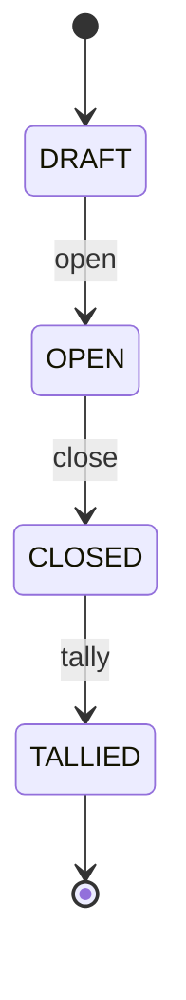

# Fluxo de votação

Passo a passo, do cadastro à apuração, com o contrato de cada endpoint.

> Os endpoints são implementados ao longo das fases 2–7. Este documento é o contrato-alvo e
> será atualizado quando a implementação divergir.

## Atores e credenciais

| Ator          | Credencial                                                     | Pode                                                                                 |
| ------------- | -------------------------------------------------------------- | ------------------------------------------------------------------------------------ |
| Administrador | `Authorization: Bearer <admin token>` (papel `ADMIN`)          | criar/abrir/fechar eleições, cadastrar candidatos e eleitores, apurar, ler auditoria |
| Mesário       | `Authorization: Bearer <operator token>` (papel `POLL_WORKER`) | habilitar eleitores                                                                  |
| Eleitor       | `Authorization: Bearer <voting token>`                         | registrar **um** voto                                                                |
| Público       | —                                                              | consultar eleição, candidatos e resultado após o fechamento                          |

## 1. Preparação (eleição em `DRAFT`)

### `POST /admin/elections`

```json
{
  "name": "Eleição do Grêmio 2026",
  "startsAt": "2026-11-01T08:00:00Z",
  "endsAt": "2026-11-01T17:00:00Z"
}
```

- `201` → `{ "id", "name", "status": "DRAFT", "startsAt", "endsAt", "createdAt" }`
- `400` body inválido: campos desconhecidos (ex.: `status`, `id`), nome vazio, com caracteres de controle ou com mais de 200 caracteres, data sem fuso horário
- `422` `endsAt <= startsAt` (também garantido por `CHECK` no banco), `startsAt` no passado, duração acima de 30 dias
- `415` content-type diferente de JSON
- Auditoria: `ELECTION_CREATED` (Fase 6)

### `POST /admin/elections/:id/candidates`

```json
{ "number": 42, "name": "Fulana de Tal" }
```

- `201` → `{ "id", "electionId", "number", "name" }`
- `400` número fora de `1..99999`, não inteiro ou enviado como string
- `404` eleição inexistente
- `409` se o número já existe na eleição (`UNIQUE (election_id, number)`)
- `409` se a eleição não está em `DRAFT` (também garantido por trigger)
- Auditoria: `CANDIDATE_CREATED` (Fase 6)

### `POST /admin/elections/:id/voters`

```json
{ "voterIdentifier": "123.456.789-09" }
```

- `201` → `{ "id", "electionId" }`. **A resposta não ecoa o identificador.**
- O identificador é normalizado e guardado como `HMAC-SHA256(pepper, identificador)`.
- `409` se já cadastrado
- Auditoria: `VOTER_REGISTERED` (sem o identificador)

### Consultas públicas

- `GET /elections/:id` → mesma forma da criação; `400` para id que não é UUID; `404` inexistente
- `GET /elections/:id/candidates` → `{ "candidates": [...] }` ordenados por número

## 2. Abertura

### `POST /admin/elections/:id/open`

- `DRAFT → OPEN`. Congela nome, janela de votação, candidatos e eleitores.
- `409` se não está em `DRAFT`; `422` sem candidatos ou com a janela já encerrada
- Feito com um único `UPDATE … WHERE status = 'DRAFT'`: chamadas concorrentes resultam em exatamente um sucesso.
- Auditoria: `ELECTION_OPENED` (Fase 6)

## 3. Habilitação (mesário)

### `POST /elections/:id/voting-sessions`

```json
{ "voterIdentifier": "123.456.789-09" }
```

Em uma única transação:

1. confere que a eleição está `OPEN` e dentro de `[startsAt, endsAt)`;
2. `UPDATE voters SET has_voted = true WHERE … AND NOT has_voted`;
3. gera `token = randomBytes(32)` (base64url);
4. grava `voting_sessions(token_hash = SHA-256(token), expires_at)`, **sem `voter_id`**;
5. registra `VOTER_AUTHORIZED` na auditoria.

Respostas:

- `201` → `{ "token": "…", "expiresAt": "…" }`. O token só aparece aqui, uma vez.
- `404` eleitor não cadastrado nesta eleição
- `409` eleitor já habilitado/votou; eleição fora de `OPEN` ou da janela

## 4. Voto (eleitor)

### `POST /ballots`

Headers:

```
Authorization: Bearer <voting token>
Idempotency-Key: <UUID gerado pelo cliente>
```

Body:

```json
{ "electionId": "…", "choice": { "type": "candidate", "number": 42 } }
```

`choice` é um destes:

```json
{ "type": "candidate", "number": 42 }
{ "type": "blank" }
{ "type": "null" }
```

Em uma única transação:

1. procura um registro de idempotência para esta chave (ver abaixo);
2. consome o token com `UPDATE … WHERE NOT consumed AND expires_at > now() RETURNING election_id`;
3. confere que `electionId` do body é o mesmo do token e que a eleição está `OPEN`;
4. resolve o candidato pelo número, dentro da eleição;
5. insere o ballot com `nullifier = HMAC(chave, token)` (`UNIQUE`) e `commitment`;
6. grava o registro de idempotência com a resposta.

Respostas:

- `201` → `{ "accepted": true, "receipt": "…" }`
- `200` → a mesma resposta original, quando é um retry idempotente
- `401` token inexistente ou expirado
- `409` token já usado (com outra `Idempotency-Key`); eleição não está aberta
- `422` candidato inexistente; mesma `Idempotency-Key` com payload diferente; `electionId` diferente do token

O token vai no header, não na URL nem no body, para não cair em access logs nem em mensagens de
validação.

### Idempotência sem vazar o voto

| Campo                 | Valor                           | Por quê                                                                                                     |
| --------------------- | ------------------------------- | ----------------------------------------------------------------------------------------------------------- |
| `scope_key`           | `HMAC(token, idempotencyKey)`   | Só quem tem o token consegue recalcular                                                                     |
| `request_fingerprint` | `HMAC(token, payload canônico)` | **Não** pode ser `SHA-256(payload)`: com poucos candidatos, o hash do payload revela o voto por força bruta |
| `response`            | status + body                   | Para devolver a mesma resposta no retry                                                                     |

Os registros são apagados no fechamento da eleição.

## 5. Fechamento

### `POST /admin/elections/:id/close`

- `OPEN → CLOSED`. Tokens pendentes deixam de valer.
- **Só a partir de `endsAt`** (`422` antes disso): um administrador não consegue encerrar a votação mais cedo.
- `409` se não está em `OPEN`
- Calcula contagem e Merkle root dos commitments, assina e registra `BALLOT_BOX_SEALED`.
- Apaga os registros de idempotência.
- Auditoria: `ELECTION_CLOSED`

## 6. Apuração

### `POST /admin/elections/:id/tally`

- Só com `CLOSED`. Recalcula e confere a Merkle root, apura e persiste.
- `CLOSED → TALLIED`
- Auditoria: `TALLY_STARTED`, `TALLY_COMPLETED`

### `GET /elections/:id/tally`

- `404`/`409` antes da apuração. **Não existe resultado parcial.**
- `200` →

```json
{
  "electionId": "…",
  "candidates": [{ "number": 42, "name": "Fulana de Tal", "votes": 120 }],
  "blank": 7,
  "null": 3,
  "totalBallots": 130,
  "authorizedWithoutBallot": 2,
  "merkleRoot": "…",
  "resultHash": "…"
}
```

## 7. Auditoria

- `GET /admin/elections/:id/audit`: eventos paginados
- `GET /admin/audit/verify`: executa `verifyAuditChain()` e informa o primeiro evento inválido, se houver

## Máquina de estados



Transições são explícitas (endpoints dedicados) e irreversíveis. Não existe `PATCH status`.
