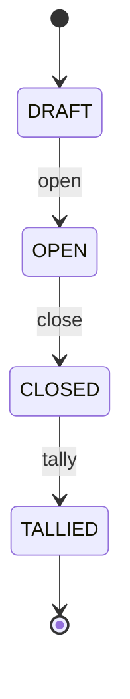

# Fluxo de votação

Passo a passo, do cadastro à apuração, com o contrato de cada endpoint.

> Os endpoints são implementados ao longo das fases 2–7. Este documento é o contrato-alvo e
> será atualizado quando a implementação divergir.

## Atores e credenciais

| Ator          | Credencial                                                     | Pode                                                                                 |
| ------------- | -------------------------------------------------------------- | ------------------------------------------------------------------------------------ |
| Administrador | `Authorization: Bearer <admin token>` (papel `ADMIN`)          | criar/abrir/fechar eleições, cadastrar candidatos e eleitores, apurar, ler auditoria |
| Mesário       | `Authorization: Bearer <operator token>` (papel `POLL_WORKER`) | habilitar eleitores                                                                  |
| Eleitor       | `Authorization: Bearer <voting token>`                         | registrar **um** voto                                                                |
| Público       | —                                                              | consultar eleição, candidatos e resultado após o fechamento                          |

## 1. Preparação (eleição em `DRAFT`)

### `POST /admin/elections`

```json
{
  "name": "Eleição do Grêmio 2026",
  "startsAt": "2026-11-01T08:00:00Z",
  "endsAt": "2026-11-01T17:00:00Z"
}
```

- `201` → `{ "id", "name", "status": "DRAFT", "startsAt", "endsAt", "createdAt" }`
- `400` body inválido: campos desconhecidos (ex.: `status`, `id`), nome vazio, com caracteres de controle ou com mais de 200 caracteres, data sem fuso horário
- `422` `endsAt <= startsAt` (também garantido por `CHECK` no banco), `startsAt` no passado, duração acima de 30 dias
- `415` content-type diferente de JSON
- Auditoria: `ELECTION_CREATED` (Fase 6)

### `POST /admin/elections/:id/candidates`

```json
{ "number": 42, "name": "Fulana de Tal" }
```

- `201` → `{ "id", "electionId", "number", "name" }`
- `400` número fora de `1..99999`, não inteiro ou enviado como string
- `404` eleição inexistente
- `409` se o número já existe na eleição (`UNIQUE (election_id, number)`)
- `409` se a eleição não está em `DRAFT` (também garantido por trigger)
- Auditoria: `CANDIDATE_CREATED` (Fase 6)

### `POST /admin/elections/:id/voters`

```json
{ "voterIdentifier": "123.456.789-09" }
```

- `201` → `{ "id", "electionId" }`. **A resposta não ecoa o identificador.**
- Aceita `###.###.###-##` ou 11 dígitos; dígitos verificadores são validados.
- O identificador é normalizado e guardado como `HMAC-SHA256(chave da eleição, cpf)` (ver [security.md](security.md)).
- `400` CPF inválido (a mensagem não repete o valor); campo extra como `hasVoted`
- `404` eleição inexistente
- `409` já cadastrado (com ou sem formatação); eleição fora de `DRAFT` (também garantido por trigger)
- Auditoria: `VOTER_REGISTERED` (Fase 6, sem o identificador)

### Consultas públicas

- `GET /elections/:id` → mesma forma da criação; `400` para id que não é UUID; `404` inexistente
- `GET /elections/:id/candidates` → `{ "candidates": [...] }` ordenados por número

## 2. Abertura

### `POST /admin/elections/:id/open`

- `DRAFT → OPEN`. Congela nome, janela de votação, candidatos e eleitores.
- `409` se não está em `DRAFT`; `422` sem candidatos, sem eleitores ou com a janela já encerrada
- Feito com um único `UPDATE … WHERE status = 'DRAFT'`: chamadas concorrentes resultam em exatamente um sucesso.
- Auditoria: `ELECTION_OPENED` (Fase 6)

## 3. Habilitação (mesário)

### `POST /elections/:id/voting-sessions`

```json
{ "voterIdentifier": "123.456.789-09" }
```

Credencial: **mesário** (`POLL_WORKER`). Token de admin recebe `401`.

Em **uma única instrução SQL** (`WITH … UPDATE … INSERT`):

1. confere que a eleição está `OPEN` e dentro de `[startsAt, endsAt)`;
2. `UPDATE voters SET has_voted = true WHERE … AND NOT has_voted`;
3. só se o passo 2 afetou uma linha: grava `voting_sessions(token_hash = SHA-256(token), expires_at)`, **sem `voter_id`**;
4. no COMMIT, a constraint trigger confere `sessões == eleitores habilitados`;
5. registra `VOTER_AUTHORIZED` na auditoria (Fase 6).

`token = randomBytes(32)` em base64url. `expiresAt = min(agora + TTL, endsAt)`.

Respostas:

- `201` → `{ "token": "…", "expiresAt": "…" }`, com `Cache-Control: no-store`. O token só aparece aqui, uma vez.
- `400` CPF inválido; campos extras (ex.: `expiresAt`)
- `404` eleição inexistente; eleitor não cadastrado **nesta** eleição
- `409` eleitor já habilitado; eleição fora de `OPEN`; antes de `startsAt` ou a partir de `endsAt`

## 4. Voto (eleitor)

### `POST /ballots`

Headers:

```
Authorization: Bearer <voting token>
Idempotency-Key: <UUID gerado pelo cliente>
```

Body:

```json
{ "electionId": "…", "choice": { "type": "candidate", "number": 42 } }
```

`choice` é um destes:

```json
{ "type": "candidate", "number": 42 }
{ "type": "blank" }
{ "type": "null" }
```

`Idempotency-Key`: 16 a 128 caracteres `[A-Za-z0-9_-]` (um UUID serve), obrigatória.

Em uma única transação `READ COMMITTED`:

1. procura um registro de idempotência para esta chave (ver abaixo); se existir, devolve a resposta guardada;
2. consome o token com `UPDATE voting_sessions SET consumed = true WHERE token_hash = $1 AND NOT consumed AND expires_at > $agora RETURNING election_id`;
3. confere que `electionId` do body é o mesmo do token;
4. resolve o candidato pelo número, dentro da eleição;
5. insere o ballot com `nullifier` (`UNIQUE`) e `commitment`;
6. grava o registro de idempotência com a resposta;
7. no COMMIT, o banco confere `votos == sessões consumidas`.

Se os passos 3 ou 4 falharem, o ROLLBACK **devolve o token**: o eleitor pode corrigir e votar.
Se o passo 2 não consumir nada, uma nova consulta (fora da transação) decide se é um retry
concorrente que acabou de terminar (devolve a resposta original) ou um token inválido/usado.

Respostas (todas com `Cache-Control: no-store`):

- `201` → `{ "accepted": true }`, com `Idempotent-Replayed: false`
- `201` → a mesma resposta, com `Idempotent-Replayed: true`, quando é um retry com a mesma chave e o mesmo payload
- `400` body inválido; `Idempotency-Key` ausente ou malformada
- `401` `Authorization` ausente/malformado (antes de ler o body); token inexistente ou expirado
- `409` token já usado (com outra `Idempotency-Key`); eleição não está `OPEN`
- `422` candidato inexistente; mesma `Idempotency-Key` com payload diferente; `electionId` diferente do token

**Sem recibo e sem id do voto.** Um recibo que identifica o voto, cruzado com a lista de votos
publicada na apuração, permitiria ao eleitor _provar_ em quem votou (venda de voto, coerção). A urna
brasileira também não emite comprovante. O custo é que o eleitor não consegue verificar que o voto
dele foi incluído (verificabilidade individual).

O token vai no header, não na URL nem no body, para não cair em access logs nem em mensagens de
validação.

### Idempotência sem vazar o voto

| Campo                 | Valor                           | Por quê                                                                                                     |
| --------------------- | ------------------------------- | ----------------------------------------------------------------------------------------------------------- |
| `scope_key`           | `HMAC(token, idempotencyKey)`   | Só quem tem o token consegue recalcular                                                                     |
| `request_fingerprint` | `HMAC(token, payload canônico)` | **Não** pode ser `SHA-256(payload)`: com poucos candidatos, o hash do payload revela o voto por força bruta |
| `response`            | status + body                   | Para devolver a mesma resposta no retry. Contém só `{ "accepted": true }`                                   |

Os registros são apagados no fechamento da eleição, na mesma transação do `OPEN → CLOSED`.

## 5. Fechamento

### `POST /admin/elections/:id/close`

- `OPEN → CLOSED`. Tokens pendentes deixam de valer.
- **Só a partir de `endsAt`** (`422` antes disso): um administrador não consegue encerrar a votação mais cedo.
- `409` se não está em `OPEN`
- Calcula contagem e Merkle root dos commitments, assina e registra `BALLOT_BOX_SEALED`.
- Apaga os registros de idempotência.
- Auditoria: `ELECTION_CLOSED`

## 6. Apuração

### `POST /admin/elections/:id/tally`

- Só com `CLOSED`. Recalcula e confere a Merkle root, apura e persiste.
- `CLOSED → TALLIED`
- Auditoria: `TALLY_STARTED`, `TALLY_COMPLETED`

### `GET /elections/:id/tally`

- `404`/`409` antes da apuração. **Não existe resultado parcial.**
- `200` →

```json
{
  "electionId": "…",
  "candidates": [{ "number": 42, "name": "Fulana de Tal", "votes": 120 }],
  "blank": 7,
  "null": 3,
  "totalBallots": 130,
  "authorizedWithoutBallot": 2,
  "merkleRoot": "…",
  "resultHash": "…"
}
```

## 7. Auditoria

Só admin.

- `GET /admin/audit?electionId=&afterSeq=0&limit=100` (`limit` ≤ 500) → `{ "events": [...], "nextAfterSeq": n | null }`
  - cada evento: `seq`, `eventType`, `actorType`, `actorIdentifier`, `electionId`, `payload`, `createdAt`, `previousHash`, `eventHash`
- `GET /admin/audit/verify[?anchorSeq=&anchorHash=]` → sempre `200`, com um relatório:
  - `{ "valid": true, "eventCount": n, "head": { "seq", "hash" } }`
  - `{ "valid": false, "eventCount": n, "failure": { "seq", "reason" } }`, com `reason` ∈ `SEQUENCE_GAP`, `BROKEN_LINK`, `HASH_MISMATCH`, `ANCHOR_MISMATCH`, `ANCHOR_NOT_FOUND`

| Evento                              | Ator        | Payload                           |
| ----------------------------------- | ----------- | --------------------------------- |
| `ELECTION_CREATED`                  | ADMIN       | `name`, `startsAt`, `endsAt`      |
| `CANDIDATE_CREATED`                 | ADMIN       | `candidateId`, `number`, `name`   |
| `VOTER_REGISTERED`                  | ADMIN       | `voterId` (nunca o CPF)           |
| `ELECTION_OPENED`                   | ADMIN       | —                                 |
| `VOTER_AUTHORIZED`                  | POLL_WORKER | — (**sem eleitor**, de propósito) |
| `ELECTION_CLOSED`                   | ADMIN       | —                                 |
| `BALLOT_BOX_SEALED`                 | SYSTEM      | contagens finais                  |
| `TALLY_STARTED` / `TALLY_COMPLETED` | —           | Fase 7                            |

Não existe `VOTE_ACCEPTED`: um evento por voto, com horário, permitiria correlacionar habilitação e voto.

## Máquina de estados



Transições são explícitas (endpoints dedicados) e irreversíveis. Não existe `PATCH status`.
